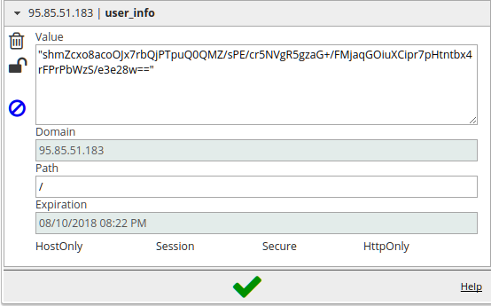
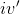
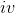
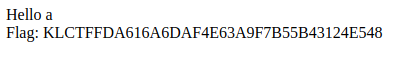

# __Kaspersky Industrial CTF Quals 2017.__ 
## __decrypt the message__

## Information
**Category:** Crypto
**Points:** 700
**Description:** 
> Could your decrypt the message? http://95.85.51.183

## Solution

All we have is a web page asking for a name and setting some strange cookie (obviously, in base64).



Decrypting it doesn't give anything, so let's try to vary name and cookie.
Varying the cookie we may bump into exception with a plenty of useful information.
```
Traceback (most recent call last):
File "/usr/local/lib/python2.7/dist-packages/flask/app.py", line 1612, in full_dispatch_request
rv = self.dispatch_request()
File "/usr/local/lib/python2.7/dist-packages/flask/app.py", line 1598, in dispatch_request
return self.view_functions[rule.endpoint](**req.view_args)
File "/var/www/FlaskApp/FlaskApp/__init__.py", line 53, in index
user_info_decrypted = json.loads(aes_decrypt(user_info).decode())
File "/var/www/FlaskApp/FlaskApp/__init__.py", line 35, in aes_decrypt
return unpad(cipher.decrypt( enc[16:] ))
File "/var/www/FlaskApp/FlaskApp/__init__.py", line 23, in unpad
return s[:-ord(s[-1])]
IndexError: string index out of range
```

From here we know that server uses Python 2.7 with Flask, it decrypts user data, decodes it into a string and loads into json. Function name (aes_decrypt) shows us the direction of research. Researching different tracebacks we find this line.

```
File "/var/www/FlaskApp/FlaskApp/__init__.py", line 34, in aes_decrypt
cipher = AES.new(base64.b64decode(hardcoded_key), AES.MODE_CBC, iv )
```

So, we finally know that cipher is AES CBC. The most popular attack on it that can be googled is [Padding Oracle Attack](https://blog.gdssecurity.com/labs/2010/9/14/automated-padding-oracle-attacks-with-padbuster.html). Trying automated scripts doesn't make any sense, so let's try to repeat something similar.

#### A piece of theory

After decoding the cookie we get a bytestring 64 bytes long.
``` \xa1d\xd6"\xdc1\x00R\r@\x1a\xe8\xcd4\x8d\xa9m\xaa\xe0{\x9c;\xa9\xc5\x8d?\x92HS-\xe2c\xbd\xe09\xb83\xe7q1)-\x89\x1b\xfe\xf3\xcbU\xb7\xcd\xbb)2\xd0\xad\xbb\xba\xbfef\x92/NK ```

AES CBC is block cipher, knowing the block size is 16 (wich we know from another traceback), we understand that first block is [IV](https://en.wikipedia.org/wiki/Initialization_vector), while three others are data (and the last block is padded).

The first thing we try is bruteforcing IV byte by byte (starting from first) and concating it with the rest of ciphertext using simple script.

```py
import requests
from base64 import b64encode, b64decode


def main():
    ciphertext = 'oWTWItwxAFINQBrozTSNqW2q4HucO6nFjT+SSFMt4mO94Dm4M+dxMSktiRv+88tVt827KTLQrbu6v2Vmki9OSw=='
    decoded_cipher = b64decode(ciphertext)
    for pos in range(0, 16):
        for i in range(0, 256):
            data = decoded_cipher[:pos] + bytes([i]) + decoded_cipher[pos + 1:]
            make_request(b64encode(data).decode())


def make_request(cookie):
    url = 'http://95.85.51.183/'
    headers = {'Cookie': 'user_info={}'.format(cookie)}
    r = requests.get(url, headers=headers)
    print(r.text[-100:])


if __name__ == '__main__':
    main()
```

What we receive are exception messages
```
UnicodeDecodeError: 'ascii' codec can't decode byte 0xda in position 0: ordinal not in range(128)
UnicodeDecodeError: 'ascii' codec can't decode byte 0xdb in position 0: ordinal not in range(128)
UnicodeDecodeError: 'ascii' codec can't decode byte 0xd8 in position 0: ordinal not in range(128)
UnicodeDecodeError: 'ascii' codec can't decode byte 0xd9 in position 0: ordinal not in range(128)
```

Oh, what is it? Server says _which_ character stands on 0 position. And we can use it to restore the plaintext.

### A piece of theory

We know that AES CBC decrypts each block and then XORes it with previous (or IV for the first one). So, knowing wrong character  and current IV byte , we can XOR them and get intermediary byte, then, by XORing it with original IV byte , we get the plaintext byte. Then we may use the first block as IV for the second and so on. 
Modify our [script](./iv_brute.py) to speed up the process.
And we get the plaintext: `{"name": "a", "show_flag": false}`.

So we see json object with `"show_flag"` property set to `false`. Obviously, we should try to set it to `true`. We've got such a name value that the word `false` is placed in the end of the second block, whereas `}` symbol is the beginning of the third. It makes task a bit easier, allowing us not to worry about paddings.

So we replace "`false`" value with `"true "` (space is added to keep the text length). Knowing that second block is XORed with encrypted first one, we may set such values in the first block that give `true` in the second after decryption. We do this by xorig each byte of `false` with byte of `'true '` and byte of first block on the corresponding places. Now, as the first block has changed, server can't decrypt the cookie. But this is not a problem, we just bruteforce IV again byte by byte from the 0th to 15th. We XOR byte on each place (again, server sends us DecodeErrors) with bruteforced IV and byte of the plaintext (which we know up to each symbol). The goal is to get valid json object. Bruteforce IV until we get valid answer from the server or until we construct valid cookie.
We got the new cookie:
``` b'\xd0F\x12`\xbd"7\xbf\x1d6cB#\xfb6\xd2m\xaa\xe0{\x9c;\xa9\xc5\x8d?\x92Z@4\xf4&\xbd\xe09\xb83\xe7q1)-\x89\x1b\xfe\xf3\xcbU\xb7\xcd\xbb)2\xd0\xad\xbb\xba\xbfef\x92/NK' ```

Encoding it with base64 and sending it to the server gives us the flag



Script for getting the cookie: [get_cookie.py](./get_cookie.py)