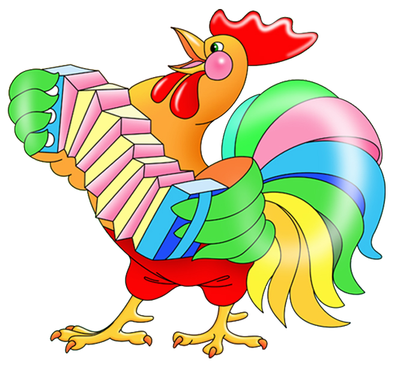

# __Kaspersky Industrial CTF Quals 2017.__ 
## _petushok_

## Information
**Category:** Joy
**Points:** 200
**Description:** 
> This is a strange picture "Petushok" http://95.85.55.168/ctfcoco.html

## Solution

We have [html page](ctfcoco.html) with table, that draws image using background colors of cells.

Looking more closely on cell classes, we can see unused "Co" names.

Now we can make a [scrypt](solver.py), that removes all "CoCo\<x\>" styles and adds color to "Co" cells. Result page contains flag.