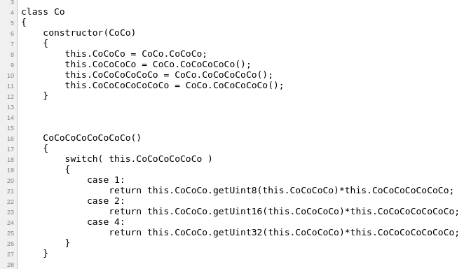

# __Kaspersky Industrial CTF Quals 2017.__ 
## _web keygen_

## Information
**Category:** | **Points:** | **Writeup Author**
--- | --- | ---
Reverse | 700 | merrychap

**Description:** 

> crackme! http://95.85.55.168/vmctf.html

## Solution
We are given the [link](http://95.85.55.168/vmctf.html) to the password validator. Let's see the HTML code:

<p align="center">
  
</p>

It seems interesting. We can see ~~cocoded~~ obfuscated javascript code and function ```GetFlag``` where we input some string. First of all, let's replace all this ```CoCo``` with a more readable name like ```a[Number of Co]```. [The code is here](a_changed.js). It's already little changed, but still doesn't mean much. You can see how we tried to understand what this thing is, but ended up with nothing.

### Reversing the code
Now, we can look at the name of the html. VMctf. Virtual Machine? Let's look at the code from this perspective.


```javascript
a56() {
    var byte = this.getNextByte();
    switch (byte) {
        case 1:  ...
        case 2:  ...
        case 3:  ...
        ...
        case 18: ...
    }


...

while (buffer.counter != 0xFFFFFFFF) {
    buffer.a56();
}

```

There is a while loop that compares ```buffer.counter``` with ```0xffffffff```. This ```buffer.counter``` looks exactly like IP register. And this ```a56()``` function executes a command depending on the instruction opcode (big case statement).

Now, let's look at the ```BufferClass``` construction:

```javascript
constructor(bufferNumbers) {
    this.dataViewBuffer = new DataView(bufferNumbers.buffer);
    this.counter = 0;
    this.numberDV = new DataView(new ArrayBuffer(32));
    var bufferLen = bufferNumbers.length;
    this.numberDV.setInt32(16,bufferLen);

```

Okay, here ```dataViewBuffer``` is the memory with .text section and the empty stack. ```counter``` is ```IP``` register and ```numberDV``` is set of 32-bit registers.

After some time of reversing this code, we get [something like this](vm.js). I should mention that there are 4 memory managers: 
 - ```UniRegHandler``` — manager for 32-, 16- and 8-bit registers.
 - ```ConstantHandler``` — used for getting constants from .text's section code.
 - ```AddressHandler8``` — manager for arbitrary 8-bit addresses.
 - ```AddressHandler32``` — manager for arbitrary 32-bit addresses.

 All code is pretty clear: There is a VM that has stack, registers and it executes instructions. So, we have the code for VM in ```var memory = new Uint8Array(...)```.

Reversing the code we see what is going on:
 - The program waits for a string with 8-byte length.
 - Compute hash of this string
 - Compare obtained hash with ```0x33e5ae40```. If they are equal, then program prints another string (actually a flag), else printf "Fail".


So, we should understand what type of a hashing is used here.

### What this hashing does
The hash function looks like this:
 
 ```python
blocks = [0x77073096,0xee0e612c, 0x990951ba, ...]

hash = 0xedcba987

def hash(input):
    for i in range(len(input)):
        r8 = (ord(input[i]) ^ hex2int(ciphr)) & 255
        index = ((0xfffffbf8 + 11220 + r8 * 4) & 0xffffffff) // 4
        block = blocks[index]
        hash = (hash >> 8) ^ block

 ```

All hex numbers is signed. ```blocks``` are statically generated list of signed numbers. So, hashing algorithm is not that hard. After all operations are executed, a hash is compared with ```0x33e5ae40```. Knowing this, we can reverse algorithm in this way:

```python
alph = ascii_letters + digits

def cracking(hash):
    for iter in range(8):
      for block in blocks:
          c = hash ^ block
          for byte in range(256):
              nhash = c + byte # pseudocoded sum here is like strings: 0x123456 + 0x78 = 0x12345678
              for symb in alph:
                  r8 = (symb ^ nhash) & 255
                  index = ((0xfffffbf8 + 11220 + r8 * 4) & 0xffffffff) // 4
                  if blocks[index] == block:
                      hash = nhash
```

But this took too much time to compute initial hash ```0xedcba987```. Because of that, we should understand how works program after comparison of input's hash and ```0x33e5ae40```.


### After comparison
If a hash of our input is equal to ```0x33e5ae40```, then program compute statically list of numbers. Further, all numbers are xored with input. Usual block cipher.
```
| INPUT | INPUT | INPUT | ... |
| LIST OF NUMBERS ....        |
| RESULTING LIST OF NUMBERS   |
```

And in the end, program prints exactly ```RESULTING LIST OF NUMBERS``` joined in a string. We know the flag format. It is ```KLCTF....```. So, it all means that we can use the certain password that will give us exactly "KLCTF" after xoring. This password is ```8XcCD...``` But it's just 5 bytes. We should use another 3. Let's just brute them. After we do it, we will xor obtained password with numbers and will get the flag.

```python
numbers = [115, 20, 32, 23, 2, 98, 42, 119, 121, 29, 33, 113, 112, 103, 94, 6, 0, 30, 91, 113, 125, 103, 95, 113, 123, 111, 80, 2, 119, 103, 90, 115, 9, 25, 39, 1, 5]
password = '8XcCDUhG'

index, flag = 0, ''
for i, num in enumerate(numbers):
    flag += chr(num ^ ord(password[i % 8]))
print(flag)
```

> And we get the flag: **KLCTF7B0AEB2426A8F829276C73A32241ADBA**


<h4>VoidHack crew with love <3</h4>
<p align="center">
  
</p>
