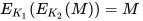

# __Sharif CTF 8__ 
## _DES_

## Information
**Category:** | **Points:** | **Writeup Author**
--- | --- | ---
Crypto | 50 | MiKHalyCH

**Description:** 

> See [known_plaintexts.txt](known_plaintexts.txt). 
There is a single unknown DES key K.
All plain texts are encrypted under K, resulting in the corresponding cipher text.
Can you find K?
flag is SharifCTF{K},
where K is a 64-bit hexadecimal value, without the 0x prefix. (K includes the parity bits.)

## Solution

There are just 2 interesting lines in [known_plaintexts.txt](known_plaintexts.txt):
> ef17ae3946ebae4c -> f084cae61e607b05

> f084cae61e607b05 -> ef17ae3946ebae4c

Like . It means, that K is [weak](https://en.wikipedia.org/wiki/Weak_key#Weak_keys_in_DES).
There are just 4 weak keys in DES. One of them is our answer.
