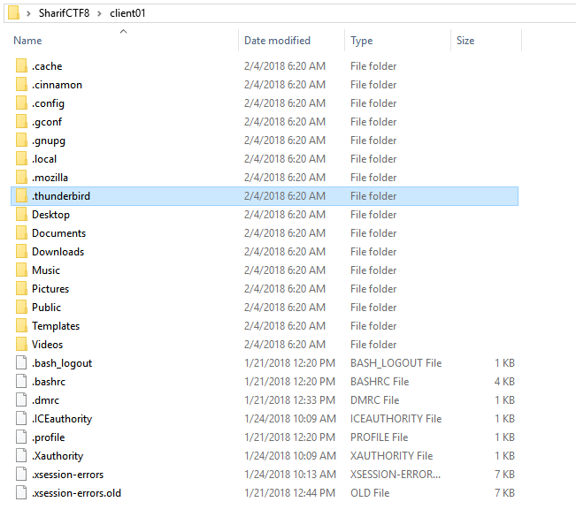
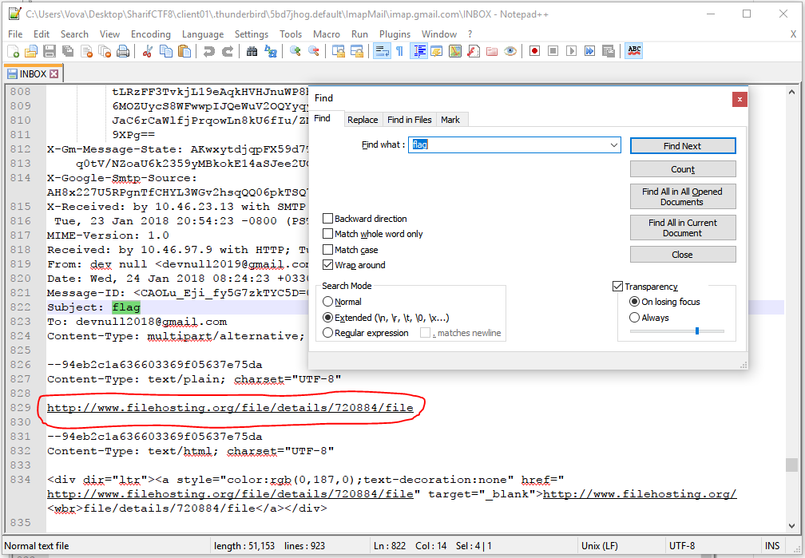
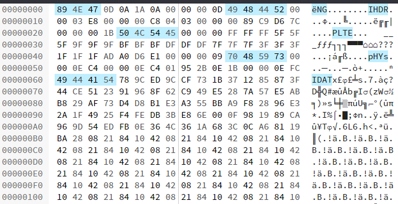
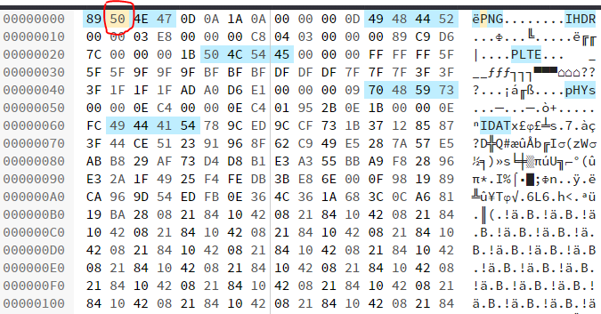
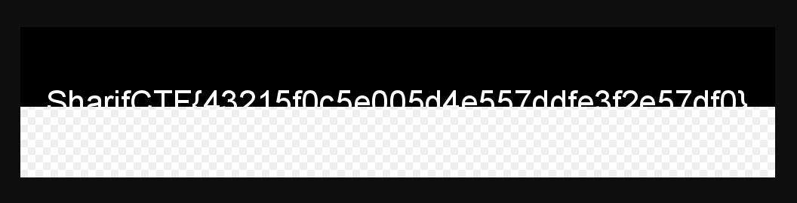

# Client01 (75 PTS)
### Desription
>Attached file is the homepage of the client01. He knows the flag.

Flag: ```SharifCTF{43215f0c5e005d4e557ddfe3f2e57df0}```

### Files

- [client01.tar.gz](client01.tar.gz)

### Solution

<p></p>

After extracting the archive we can see a lot of strange folders, but I'll give you a little hint: we're interested only in ```.thunderbird```. That's an email client, so we're going to look at inbox messages (```/.thunderbird/5bd7jhog.default/ImapMail/imap.gmail.com/INBOX```).

<p></p>

What a luck! There's a message contains ```flag``` right in its subject! Look below, you see a link, didn't you?
Yes, this is a file hosting, where we can download the file called ```flag```.

So, how can we open it? Try to use binwalk:

```
C:\Users\Vova\Desktop\SharifCTF8\> echo import binwalk; binwalk.scan('-B', 'file') | python
DECIMAL       HEXADECIMAL     DESCRIPTION
--------------------------------------------------------------------------------
100           0x64            Zlib compressed data, default compression

C:\Users\Vova\Desktop\SharifCTF8\>
```

Um, zlib? Not from 0x00? It's strange, we need look INSIDE that file.

<p></p>

Wow, see that chunks? It's seems like a PNG file, but... for now it is not PNG, it's ```NG``` file.
Let's add a single byte to the header:

<p></p>

OK, now we can open it.

<p></p>

Oops, someone stole a half of the flag! But we still can submit it.
