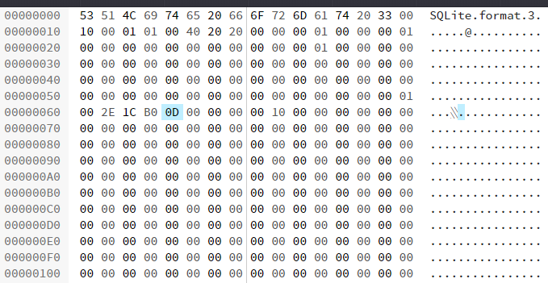
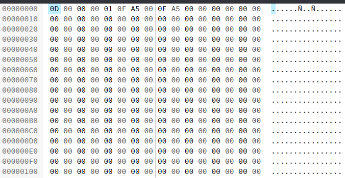
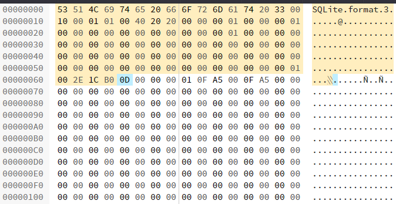
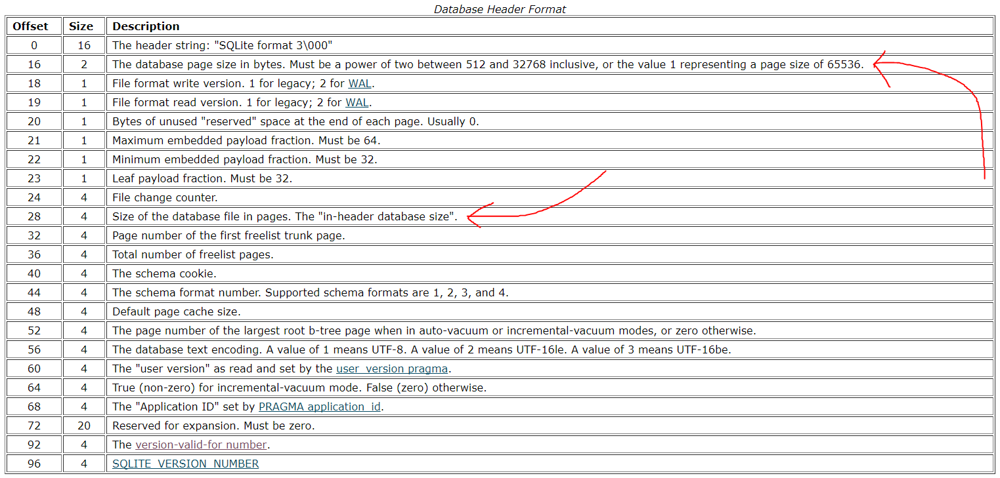
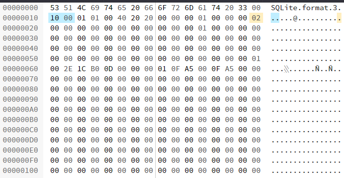

# Crashed DB (50 PTS)
### Desription
>We lost some data when we were delivering our DB.
>Can you recover it??

>Hint: SQLite

Flag: ```SharifCTF{9da6c560516c13e08d02893f99ca545f}```

### Files

- [db0.db](db0.db)

### Solution

It's .db file, right? Let's try to open it as a SQLite database!

```
C:\Users\Vova\Desktop\SharifCTF8> sqlite3.exe db0.db
SQLite version 3.22.0 2018-01-22 18:45:57
Enter ".help" for usage hints.
sqlite> .dbinfo
unable to read database header
sqlite>
```

Woah, look at that! Wrong header. We could look at SQLite3 database format specification, but it's too hard for the 50 points task, yeah?
So let's just create an empty table.

```
C:\Users\Vova\Desktop\SharifCTF8> sqlite3.exe
SQLite version 3.22.0 2018-01-22 18:45:57
Enter ".help" for usage hints.
Connected to a transient in-memory database.
Use ".open FILENAME" to reopen on a persistent database.
sqlite> .save temp.db
sqlite> .exit
C:\Users\Vova\Desktop\SharifCTF8>
```

Now we've got two files. Let's look at our temp.db:
<p></p>
And then at original db:
<p></p>

Have you see the same byte? Right, what if just paste bytes before that byte in our database?
<p></p>
That is, then save it as updated.db and try to open it now:

```
C:\Users\Vova\Desktop\SharifCTF8> sqlite3.exe updated.db
SQLite version 3.22.0 2018-01-22 18:45:57
Enter ".help" for usage hints.
sqlite> .dbinfo
database page size:  4096
write format:        1
read format:         1
reserved bytes:      0
...
sqlite>
```

Perfect! It must be a valid database now. Let's look at the tables:

```
sqlite> .schema
CREATE TABLE tbl (Glaf varchar(15), Flag varchar(1), Lfag varchar(15));
sqlite> SELECT * FROM tbl;
Error: database disk image is malformed
sqlite>
```

Oh no, that's invalid! Sorry, but we need to look at format specification.
<p></p>
We're interested in two things: page size and database size (in pages). Size of original db0.db is 8 KB, our page size is 0x1000 = 4096 B... Yeah, 2 pages! Change it:
<p></p>
Now we finally can extract the flag:

```
C:\Users\Vova\Desktop\SharifCTF8> sqlite3.exe updated.db
SQLite version 3.22.0 2018-01-22 18:45:57
Enter ".help" for usage hints.
sqlite> .tables
tbl
sqlite> .schema
CREATE TABLE tbl (Glaf varchar(15), Flag varchar(1), Lfag varchar(15));
sqlite> SELECT GROUP_CONCAT(Flag, '') FROM tbl;
SharifCTF{9da6c560516c13e08d02893f99ca545f}
sqlite>
```
