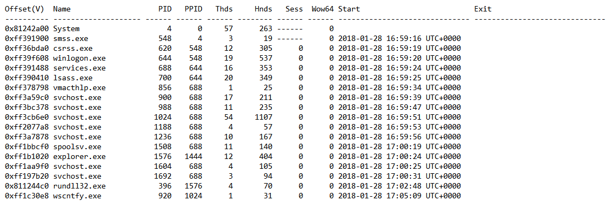
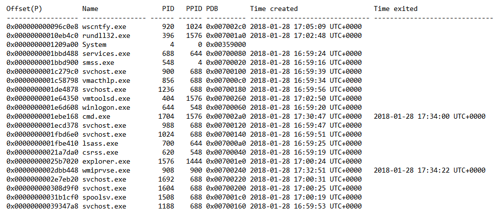
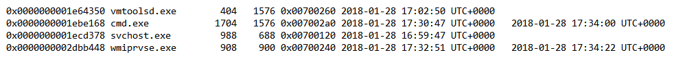

# Hidden (100 PTS)
### Description
>Find the hidden process.
>The flag is SharifCTF{MD5(Process id)}.

Flag: ```SharifCTF{4f4adcbf8c6f66dcfc8a3282ac2bf10a}```

### Files

- [dump.zip](dump.zip)

### Solution
 
 Inside of the given archive we can found a raw dump of windows memory. It sounds like [Volatility](http://www.volatilityfoundation.org/) can support us to investigate that dump.
 Let's take two listings from commands:
 - ```psscan``` (it shows all processes, include hidden) 
 - ```pslist``` (it show only visible processes)

```
C:\Users\Vova\Desktop\SharifCTF8> volatility.exe -f dump pslist > pslist.txt
Volatility Foundation Volatility Framework 2.4

C:\Users\Vova\Desktop\SharifCTF8> volatility.exe -f dump psscan > psscan.txt
Volatility Foundation Volatility Framework 2.4

C:\Users\Vova\Desktop\SharifCTF8> 
```

Now we should find a difference between two files. ```fc``` won't help there cause they aren't in the same format.

<p></p>

<p></p>

So, can you see the difference? Yes, these four processes:

<p></p>

As you see, half of them was closed, and we need to submit one PIDs. It's time to guess..
