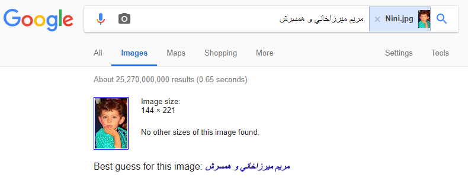

# Nini (40 PTS)
### Description

>What is the most important prize she honored?
>
>The flag is SharifCTF{MD5(lowercase(Prize name))}.

Flag: ```SharifCTF{537cd12c5f65d15dd11cc5d7f27127a8}```

### Files

- [Nini.jpg](Nini.jpg)

### Solution

It looks like a recon task, so... Google is our assistant.

<p></p>

Great! But I don't know what language is it, so maybe Google also knows a translation?

```
مريم ميرزاخاني و همسرش --> Maryam Mirzakhani and her husband
```

He actually knows! (not expected huh?)
It's time for Wikipedia now. What does it say?

#### Awards and honors:

- Gold medal. International Mathematical Olympiad (Hong Kong 1994)
- Gold medal. International Mathematical Olympiad (Canada 1995)
- IPM Fellowship, Tehran, Iran, 1995–1999
- Merit fellowship Harvard University, 2003
- Harvard Junior Fellowship Harvard University, 2003
- Clay Mathematics Institute Research Fellow 2004
- AMS Blumenthal Award 2009
- Invited to talk at the International Congress of Mathematicians in 2010
- The 2013 AMS Ruth Lyttle Satter Prize in Mathematics
- Simons Investigator Award 2013
- Named one of Nature magazine's ten "people who mattered" of 2014
- Clay Research Award 2014
- Plenary speaker at the International Congress of Mathematicians (ICM 2014)
- Fields Medal 2014
- Elected foreign associate to the French Academy of Sciences in 2015
- Elected to the American Philosophical Society in 2015
- National Academy of Sciences 2016
- Elected to the American Academy of Arts and Sciences in 2017

You can try it all or just pick ```Fields Medal 2014``` ;)
So, according on description we can construct the flag!

```
SharifCTF{md5(fields medal)}
```
