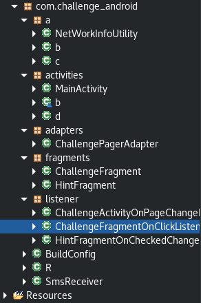

# __Sharif CTF 8__ 
## _Barnamak_

## Information
**Category:** | **Points:** | **Writeup Author**
--- | --- | ---
Reverse | 200 | merrychap

**Description:** 

> Run the application and capture the flag!

## Solution
### Decompiling
We are given with apk file. First of all, we have to decompile it. I used [jadx](https://github.com/skylot/jadx) for this, but you can use whatever tool you want. Okay, let's break into the code!

<p align="center">
  
</p>

### Code reversing
As we can see, this apk is some challenge service where we have to pass 2 checks (as said in the ```Resourses/res/values/strings.xml```).

There are many different classes: network availability checker, some views and fragments (it's a kind of subview), SMS sender, and others.

The interesting class here is ```ChallengeFragmentOnClickListener```. It tells us what is going on when we click on Challenge button.

<script src="https://gist.github.com/merrychap/30b7b3d724bb99daedaf526b7d81e4c7.js"></script>

### Checks
```ChallengeFragmentOnClickListener``` class has ```ChallengeFragment``` field, about which we will tell later. In the onClick function happen the next checks:

```java
private ChallengeFragment fragment;

[...]

if (this.fragment.b()) {
    this.fragment.a();
    return;
}
```

Let's explore ```ChallengeFragment``` class for understanding above ```a``` and ```b``` functions:

<script src="https://gist.github.com/merrychap/a5143e10e5fee69e193bb875e5fcba6b.js"></script>

First of all, let's start with ```b``` function. It checks the location of a device. So, it gives us the knowledge of the correct location. 
```
location.getLatitude()  == 45
location.getLongitude() == -93
```

The next function is ```a```. A little bit more complex, but still readable. As we know, if ```b``` check is True, then ```a``` happens.

```java
if (c.a() || c.b() || c.c()) {
```

The code of ```c``` class is placed below:

<script src="https://gist.github.com/merrychap/7d294863a03dc9fabc8ba3908dbd129d.js"></script>

Functions of this class check if we can get root privilege on a device. So, if we can, then happens the next:

```java
String Res = ChallengeFragment.iia(new int[]{162, 136, 133, 131, 68, 141, 119, 68, 169, 160, 49, 68, 171, TransportMediator.KEYCODE_MEDIA_RECORD, 68, 168, 139, 138, 131, 112, 141, 113, 128, 129}, String.valueOf((int) Math.round(ChallengeFragment.this.location.getLatitude())));

Toast.makeText(ChallengeFragment.this.getActivity().getBaseContext(), Res, 0).show();
```

It's obviuos that ```iia``` function is some kind of decoding. So, if we execute this, then we will get the next message ```Flag is MD5 O Longtiude```. As we know, ```location.getLongitude() == -93```, so we have to just get md5 hash of "-93". Alright, that's all folks.


> SharifCTF{87a20a335768a82441478f655afd95fe}

<p align="center">
  
</p>