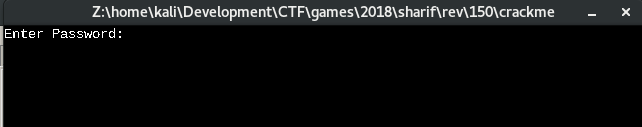
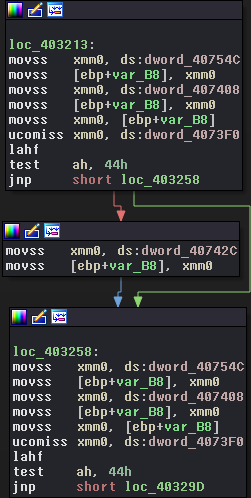
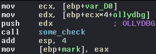
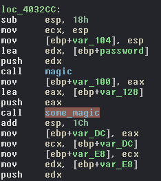
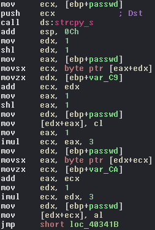
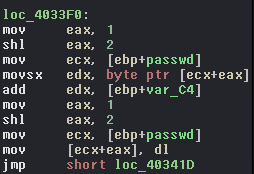
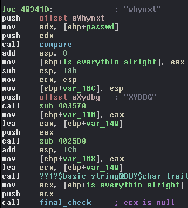
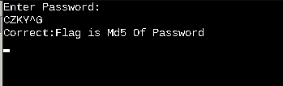

# __Sharif CTF 8__ 
## _Crack me!_

## Information
**Category:** | **Points:** | **Writeup Author**
--- | --- | ---
Reverse | 150 | merrychap

**Description:** 

> Find the password.

## Solution
Okay, we have the [binary](./crackme). Let's see what is going on under the hood of this binary.

<p align="center">
  
</p>

### xmm obfuscation
Assembly code contains many operations with [```xmm```](https://en.wikipedia.org/wiki/Streaming_SIMD_Extensions) registers (they used in operations on several floating point/packed values).

<p align="center">
  
</p>

It seems like a kind of obfuscation, so we can just skip all parts of the code containing such instructions.

### Debugger verification
First of all, we are faced with verification of debugger if we use a debugger.

<p align="center">
  
</p>

In a moment of debugging, ```ollydbg``` (_I'm sorry for a confusing name!_) actually contains the name of a debugger (in out case it's ```OLLYDBG``` or ```idaq.exe```). After reversing ```some_check``` function we can see that required debugger is ```idaq.exe```.

On my OS only ollydbg is available (for debugging PE executables), so I just patched this check to always return True.

After this, we want to understand two things:
- How our input will be changed further and where it will be changed.
- How input's validation looks like and where it's placed.

### Password is xored
If we pass debugger check, then we will be faced with ```flag maybe here:``` string. So, this part of the program is desirable for us. Skipping all xmm obfuscation we can find interesting place:

<p align="center">
  
</p>

What is going on here? Actually, in ```some_magic``` function we blockwise xor our password with ```423``` string.

After xor we change several bytes in a password (only 2 bytes).

### The first change

<p align="center">
  
</p>

Here we change 2 bytes of our xored password:
```asm
[...]
    mov [edx+eax], cl
[...]
    mov [edx+ecx], al
[...]
```

As I noticed, bytes in ```[ebp+var_C9]``` and ```[ebp+var_CA]``` differs on different downloads of binary (I can be wrong here, so tell me if I'm wrong). So, it's like a kind of anti-cheat system. Be attentive in this part.

### The second change
<p align="center">
  
</p>

And this is the same change as I mentioned above. The offset for changing the byte is placed in ```[ebp+var_C4]```. The change itself is:

```asm
[...]
    mov [ecx+eax], dl
[...]
```

### Password validation
<p align="center">
  
</p>

After all changes with our password are done, it compares with ```whynxt``` string. If they are equal, then it sets ```eax``` register to 0 and saves result in ```[ebp+is_everything_alright]```. After this, we store obtained result in ```ecx``` and send it to ```final_check``` function. If ```ecx``` is 0, then we are faced with the next:

<p align="center">
  
</p>

### Flag

> SharifCTF{609b1281417bab0d3612786137a5c70e}