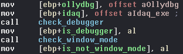
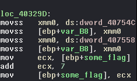
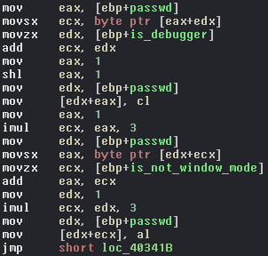
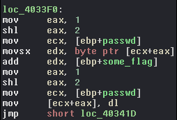

# __Sharif CTF 8__ 
## _Crack me!_

## Information
**Category:** | **Points:** | **Writeup Author**
--- | --- | ---
Reverse | 150 | merrychap

**Description:** 

> Find the password.

## Solution
Okay, we have the [binary](./crackme). Let's see what is going on under the hood of this binary.

<p align="center">
  
</p>

### xmm obfuscation
Assembly code contains many operations with [```xmm```](https://en.wikipedia.org/wiki/Streaming_SIMD_Extensions) registers (they used in operations on several floating point/packed values).

<p align="center">
  
</p>

It seems like a kind of obfuscation, so we can just skip all parts of the code containing such instructions.

### Debugger verification
First of all, we are faced with verification of debugger if we use a debugger.

<p align="center">
  
</p>

In a moment of debugging, ```ollydbg``` (_I'm sorry for a confusing name!_) actually contains the name of a debugger (in out case it's ```OLLYDBG``` or ```idaq.exe```). After reversing ```some_check``` function we can see the next: If we use a debugger, then it has to be ```idaq.exe```.

On my OS only ollydbg is available (for debugging PE executables), so I just patched this check to always return True.

After this, we want to understand two things:
- How our input will be changed further and where it will be changed.
- How input's validation looks like and where it's placed.

### Several marks
There are several marks that will make an effect on some bytes of the flag. They are created in the beginning of the program:

<p align="center">
  
</p>

<p align="center">
  
</p>

These marks are:
- ```is_debugger```. If we use a debugger, then it's ```1```, else ```0```.
- ```is_not_window_mode```. If we run an application not in window mode (double click on the icon :D), then it's ```1```, else ```0```
- ```some_flag```. This mark is changed in some parts of the code.

We will tell about the effect of this marks on the password a little bit later.

### Password is xored
If we pass debugger check, then we will be faced with ```flag maybe here:``` string. So, this part of the program is desirable for us. Skipping all xmm obfuscation we can find interesting place:

<p align="center">
  
</p>

What is going on here? Actually, in ```some_magic``` function we blockwise xor our password with ```423``` string.

After xor we change several bytes in a password (only 2 bytes).

### Effect of the marks
After xoring, we can see the next blocks of the code:

<p align="center">
  
</p>

<p align="center">
  
</p>

As you can see from the pictures above, this code does something like this:
```c
password[2] += is_debugger
password[3] += is_not_window_mode
password[4] += some_flag
```

### Password validation
<p align="center">
  
</p>

After all changes with our password are done, it compares with ```whynxt``` string. If they are equal, then it sets ```eax``` register to 0 and saves result in ```[ebp+is_everything_alright]```. After this, we store obtained result in ```ecx``` and send it to ```final_check``` function. If ```ecx``` is 0, then we are faced with the message ```Correct:Flag is Md5 Of the password```.

So, it seems like we have to make all marks above (is_debugger, window_mode, some_flag) equal to ```0```, because in other cases we will be faced with ```Try again``` message at normal launch (without debugger, in window mode, etc). After spending some time, we get the password: ```CZJYJG```.

### Flag

> SharifCTF{2bc98b4ebc8d75050d162a45b82df6ae}