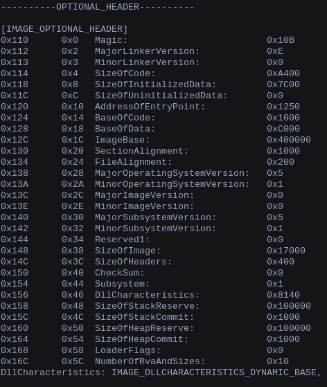

# __Sharif CTF 8__ 
## _Run me_

## Information
**Category:** | **Points:** | **Writeup Author**
--- | --- | ---
Reverse | 50 | merrychap

**Description:** 

> Run the attached file. If you can, you will capture the flag.

> **Note**: Apply the minimum changes to make the file executable. Then, the mentioned hash function is md5. Be sure to run it on a real Windows OS (not Wine, etc.)

## Solution
We are given with ```PE32``` [RunMe](./RunMe1) binary. If we run this on Windows OS, then we're faced with the problem: ```Unable to start the file ...```. Interesting that if we run this under Wine, then everything will be okay and we get the message ```You succeeded to run the file. flag is hash of file```. As note says, we have to make this binary run on Windows OS.

OS doesn't allow us to just break into the first instruction of the binary. Seems like something wrong with PE32 headers. Let's download some tool for exploring fields of a header (for example [pefile](https://github.com/erocarrera/pefile))

After some investigation we can find the interesting ```Subsystem``` field (```0x154 offset```).

<p align="center">
  
</p>

As MSDN says,

> Subsystem is the type of subsystem that this executable uses for its user interface.

There are several values for this field:

```
+-------------+---+-----------------------------------+
| NATIVE      | 1 | Doesn't require a subsystem       |
|             |   | (such as a device driver)         |
+-------------+---+-----------------------------------+
| Windows GUI | 2 | Runs in the Windows GUI subsystem |
+-------------+---+-----------------------------------+
| WINDOWS_CUI | 3 | Runs in console subsystem         |
+-------------+---+-----------------------------------+
```

So, right now our subsystem is for device driver. But our binary shows a window with the message! Let's change it on 2 and try again.

<p align="center">
  
</p>

## Flag
The last one is to take md5 hash:

> SharifCTF{FA77D55C1D9BDE713E868606AC58D861}