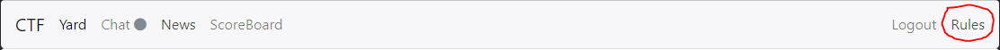

# Hello Rules!! (10 PTS)
### Description

>Find the flag in the rule page

Flag: ```SharifCTF{053e3df6d82735fa4f708f3d61f2c903}```

### Solution

As description said we're going to the rule page.

<p></p>

We should carefully read the page and see a line at the bottom:

```
The flag of this challenge is SharifCTF{MD5(lowercase(Hello_Rules))}
```

Understandable, right?

```
C:\Users\Vova\Desktop\SharifCTF8> python
Python 3.6.4 (v3.6.4:d48eceb, Dec 19 2017, 06:04:45) [MSC v.1900 32 bit (Intel)] on win32
Type "help", "copyright", "credits" or "license" for more information.
>>> from hashlib import md5
>>> str = 'Hello_Rules'.lower()
>>> hash = md5(str.encode()).hexdigest()
>>> 'SharifCTF{' + hash + '}'
'SharifCTF{053e3df6d82735fa4f708f3d61f2c903}'
>>>
```
