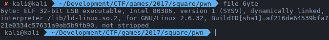
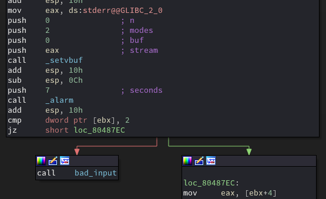
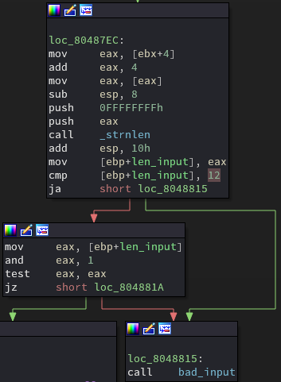
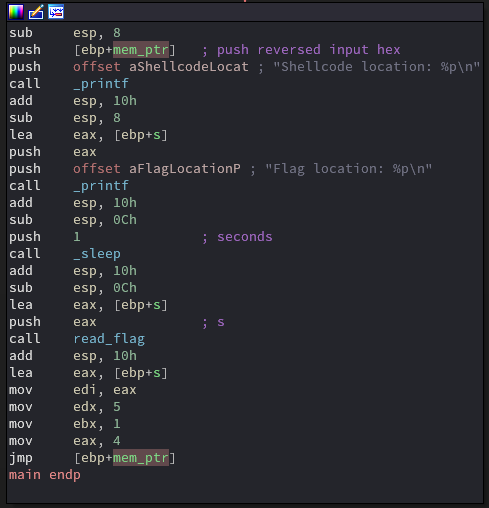
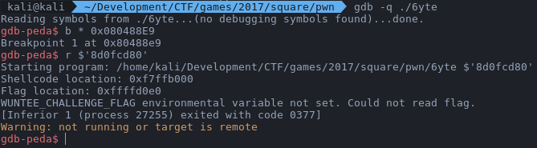
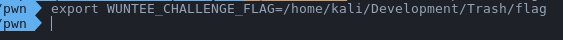
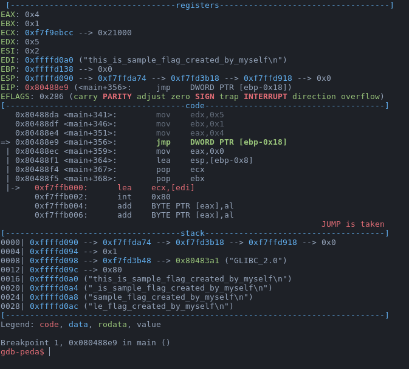
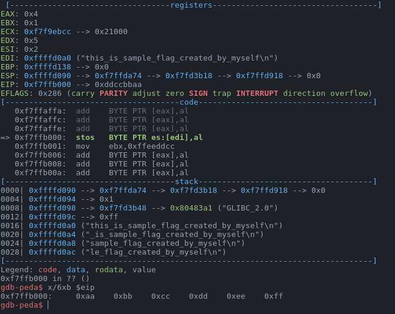
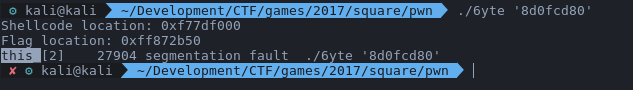

# __Square CTF 2017__ 
## _6yte_

## Information
**Category:** | **Points:** | **Writeup Author**
--- | --- | ---
Exploit | 1000 | merrychap

**Description:** 

> Our operatives found this site, which appears to control some of the androids’ infrastructure! There are only two problems. The robots love x86 assembly; the only thing easier for them to work with is binary. And they love terse command codes. Even 7 bytes was too many for this one.
This URL is unique to your team! Don't share it with competitors!
https://zahir-todyf-movav-fygas-codag.capturethesquare.com


## Solution
On the page we can find a binary and text, that says:

>You can send up to 6 bytes (hex encoded) as the first argument to the binary. The passed in bytes will be executed. The goal is to read the contents of the file in env['WUNTEE_CHALLENGE_FLAG'].

Okay then, the first we have to do is to download the [binary](6byte) and examine its functionality. Using ```file``` utility we see that it's 32-bit binary:

<p align="center">
  
</p>

Let's open the binary in IDA Pro. First of all, we're faced with argc length checking. From this, we know, that length of argc must be 2.

<p align="center">
  
</p>

It means that we pass our 6 bytes **through command line parameters**. If args is equal to 2, then binary checks length of a passed string. It must be 12 bytes long because each byte presented with 2 symbols

<p align="center">
  
</p>

When all checks are completed, the program converts a passed string into 6 real bytes. That is, if you input ```aabbccddeeff```, then program converts it into bytes sequence ```0xaa 0xbb 0xcc 0xdd 0xee 0xff```. After this, the main function starts:

<p align="center">
  
</p>

In this part of the code, the program prints locations of the flag and the shellcode (our input), and then jumps to the shellcode. Sounds pretty nice. We can run the debugger and see all this in action.

I'll use gdb+peda, but you can use whatever debugger you want. Let's set the breakpoint on ```jmp DWORD PTR [ebp-0x18]```, because in fact, it's the only one interesting place to debug.

<p align="center">
  
</p>

When we try to run the binary, we faced with the problem: we just don't have ```WUNTEE_CHALLENGE_FLAG``` environment variable. It's not a problem at all. We create a file named "flag" and write to it the string ```this_is_sample_flag_created_by_myself```. After this let's create the right environment variable:

<p align="center">
  
</p>

Try to run it again with ```aabbccddeeff```... Yes, everything is okay.

<p align="center">
  
</p>

Once you are at the ```jmp``` instruction, step in and see what do we have there.

<p align="center">
  
</p>

This is where the real task begins. Let's recall that we have right now. The flag is located in our memory and we can see it. Also, we can control 6 executable bytes. So, the simplest (and the only one) idea is next: we use ```write``` syscall to write the flag into the output stream.

Let's examine the registers for that: ```eax = 0x4; ebx = 0x1; edx = 0x5```. It means that we will write to the stdout 5 bytes of a buffer stored in the ```ecx```. But ecx stores something useless! Yes, this is why we need this 6 bytes of our input. You can notice that ```edi``` contains flag address, so the goal is to move this address to ```ecx```. We can input ```lea ecx, [edi]; syscall;``` (in bytes it's ```8d0fcd80```)assembly instruction to output first 5 bytes of the flag.

<p align="center">
  
</p>

Okay, when we get the first 5 bytes of the flag, we can use an offset in the ```lea``` instruction like this: ```lea ecx, [edi+5]``` to print next 5 bytes and so on. By the way, you can use ```rasm2``` to convert assembly instructions into bytes.

That's all. Just apply this technique on the CTF server.

For our team flag is: 

> flag-vizuv-solyb-rasun-korud-lyvad