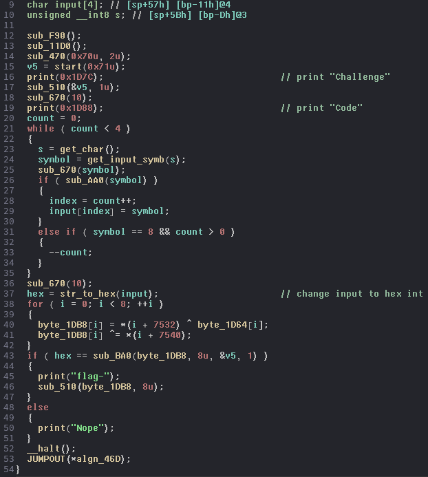
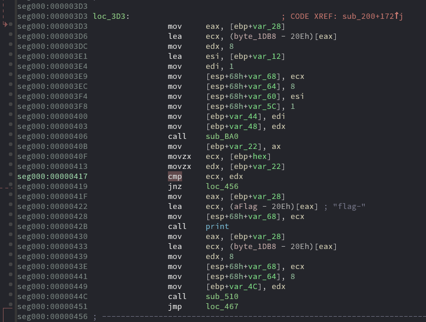
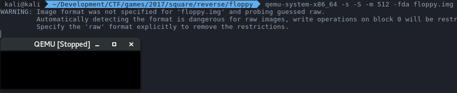
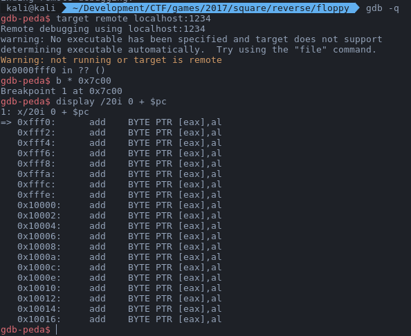
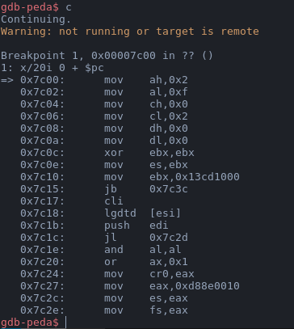
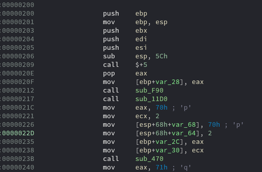
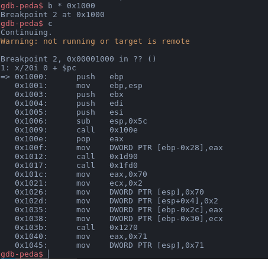
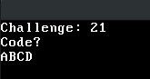
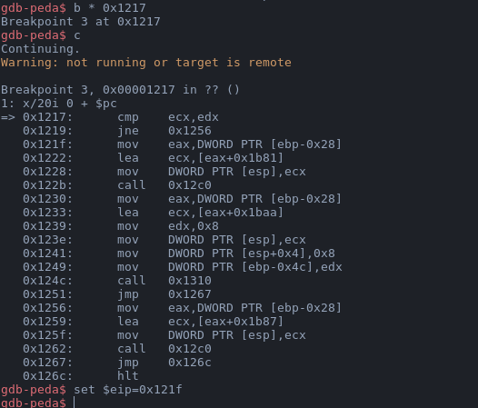
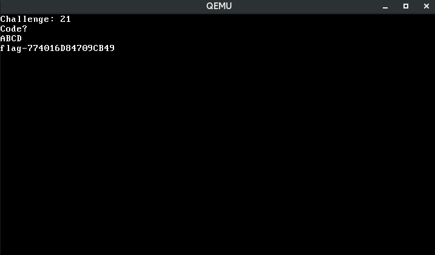

# __Square CTF 2017__ 
## _floppy_

## Information
**Category:** | **Points:** | **Writeup Author**
--- | --- | ---
Reverse | 1000 | merrychap

**Description:** 

> Our team of corn snakes formed an uneasy alliance with the office mice and slithered into the server room of Evil Robot Corp. They extracted an image of the VPN server before they had to retreat. Turns out sending a team of reptiles into a room whose main purpose is to keep its contents cold wasn’t the best idea.
Can you figure out how this bootable [floppy](floppy.img) works and recover the secret data?

## Solution
First of all, we should understand what this thing is. Using ```file```, we see that this is ```DOS/MBR boot sector```.

```sh
$ file floppy.img 
floppy.img: DOS/MBR boot sector
```

What should we do with it? If you try to run it, you fail, because of ```format error```. Hence, we should find an emulator for this type of system. I'll use ```qemu```. 

In the first place, we have to see the code of this MBR. Using IDA Pro we can see the next code (some functions are already renamed):

<p align="center">
  
</p>

This function does the next:
- 16 line: Prints "Challenge" with some random number
- 19 line: Prints "Code?"
- 21 — 35 lines: Inputs a string with 4 bytes length.
- 37 line: Translates the string into hex format (I'm not sure about this function, it isn't necessary for the solution)
- 38 — 42: Generates 8 bytes and stores them in ```byte_1DB8```
- Compares processed ```hex``` and result of ```sub_BA0``` function
    - If the are equal, then prints the "flag" and then execute ```sub_510``` with ```byte_1DB8``` as the first argument.
    - Else prints "Nope".

There are two ways to solve this challenge:
1. Understand how ```sub_BA0``` works and find appropriate input that will satisfy to the comparison
2. Execute all instructions until comparison. After this, set ```eip``` to ```call sub_510```. Input in this case is useless, because doesn't take part in calculating the flag. So it will give us the flag without any effort.

I chose the second variant because it's faster. This is where that comparison is in disassembly:

<p align="center">
  
</p>

But to do this trick with ```eip``` we have to be in debugging mode. This is where problems come. 

First of all, we should run qemu with the possibility of attaching the debugger (gdb, in our case) to the binary. After hours of reading different web pages about it, I found the brilliant [tutorial](https://rwmj.wordpress.com/2011/10/12/tip-debugging-the-early-boot-process-with-qemu-and-gdb/). As we can see, to run qemu in this mode we should do the next:
```sh
qemu-system-x86_64 -s -S -m 512 -fda winxp.img
```

And now we can see, that qemu is running:

<p align="center">
  
</p>

Alright, we know from this article, that the address when MBR is loaded is ```0x7c00```. Let's attach to this process in the ```gdb``` and set breakpoint at this address.

<p align="center">
  
</p>

Continue execution until the ```0x7c00``` address:

<p align="center">
  
</p>


When everything is done, we have to find the address of the start function. She is shown below:

<p align="center">
  
</p>

After some debugging steps, we find that the desired function is placed under ```0x1000``` address:

<p align="center">
  
</p>

Okay, we are almost done! Now, let's calculate the offset of that last comparison from ```0x200``` (it's the address of start function in disassembly). Offset is ```0x217```, so let's set breakpoint at the ```0x1217``` and continue execution. Program waits for an input. We input random 4 bytes.

<p align="center">
  
</p>


When we are at that ```cmp``` instruction we have to just change ```eip``` register to ```0x121f``` and continue execution.

<p align="center">
  
</p>

And this is what the binary gives us after comparison:

<p align="center">
  
</p>

So, the flag is:

> flag-774016DB4709CB49