# __Square CTF 2017__ 
## _The Turing Agent_

## Information
**Category:** | **Points:** | **Writeup Author**
--- | --- | ---
Reverse | 500 | merrychap

**Description:** 

>The hamsters have triumphed! We found an open [Github repository](https://github.com/Ahris/the_turing_agent)! It looks like some sort of game; perhaps they’re planning to trick our humans into playing it. We need to know if there’s any data hidden in the game that might harm our humans.
Note: You'll need to prepend "flag-" to the flag.

## Solution
It's the most interesting and the most difficult (for me) challenge in this CTF.
We are given with several files:
- Hints files: [bighint](bighint.txt) and [smallhint](smallhint.txt)
- [Some readme](README.txt)
- [Tools list](tools.txt)
- And the [challenge](mission.gb) itself

Using ```file``` we see that this is Game Boy ROM image.

```sh
$ file mission.gb
mission.gb: Game Boy ROM image (Rev.01) [ROM ONLY], ROM: 256Kbit
```

Also, we can read [tools.txt]((tools.txt)) and find several debuggers for Gameboy. I'll use [```bgb```](http://bgb.bircd.org/) debugger. (Although all these debuggers are buggy).


### Using BGB
After several hours of setting up this debugger, finally, I came to this:

<p align="center">
  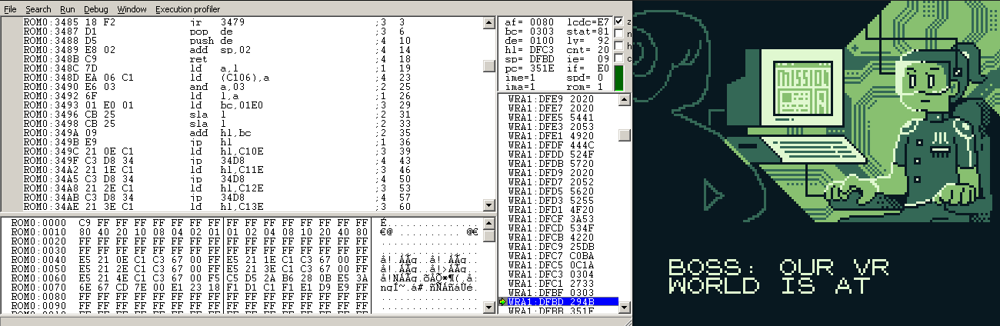
</p>

Yay! It's finally started correctly under debugging mode. So, there is one very important instruction that requires the breakpoint — ```halt``` at ```0x351E``` address. When the ```halt``` instruction is called, the Gameboy stops executing instructions until an interrupt occurs. For us it means that all changes on the screen produced after this instruction. So, it's the convenient place to set the breakpoint.

<p align="center">
  
</p>


### The task itself
Now, we can continue executing until task itself is show:

<p align="center">
  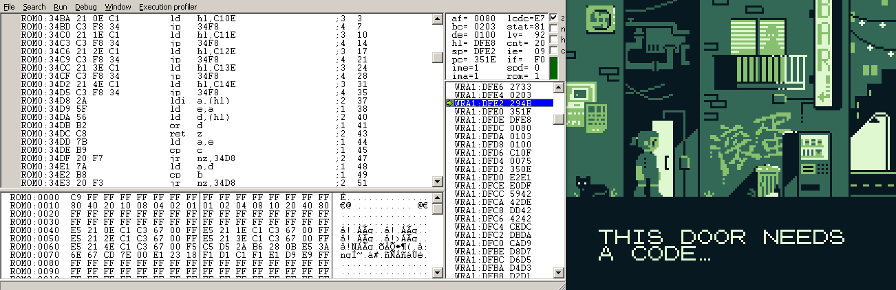
</p>

So, after this text, the program waits for our 16 symbols input. We can input the next symbols:
- up-arrow
- left-arrow
- down-arrow
- right-arrow
- box button
- arrow button

These are all Gameboy's controllers. So, after entering a sequence of symbols, the binary have to compare them with the correct sequence. It's obvious. Of course, it's not, because the binary can comapre hashes of sequences, but after completing I can say, that only sequences are compared.

Anyway, let's input something:

<p align="center">
  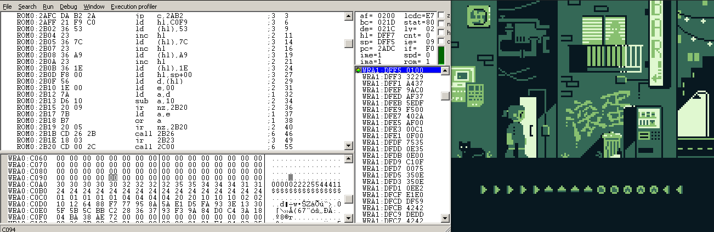
</p>

Now, you should be very careful, because there is one important moment. Look closely at ```0xC0A0``` and ```0xC0C0``` addresses. At the ```0xC0A0``` address placed our inputted string where each byte is a  symbol from the input, corresponding to the next table:

Symbol | Byte (in printable)
--- | ---
🡆 | 0 (0x30)
🡄 | 1 (0x31)
🡅 | 2 (0x32)
🡇 | 3 (0x33)
⌃ | 4 (0x34)
🢬 | 5 (0x35)

And now look at the ```0xC0C0``` address. Each byte then transformed into another, corresponding to the yet another table:

Symbol | Byte
--- | ---
🡆 | 0x1
🡄 | 0x2
🡅 | 0x4
🡇 | 0x8
⌃ | 0x10
🢬 | 0x20

I understand that it's hard to see in the first time, but if you try it several times, you'll definitely notice it. 

### Time for reversing
You can ask me now "And what should we do after this?". It's time to see the disassembled binary. Of course, we can see it in ```bgb```, but it's very inconvenient for me. Because of that, I'll use IDA Pro.

When IDA runs, it asks about processor architecture. Choose ```Zilog 80 [z80]```:

<p align="center">
  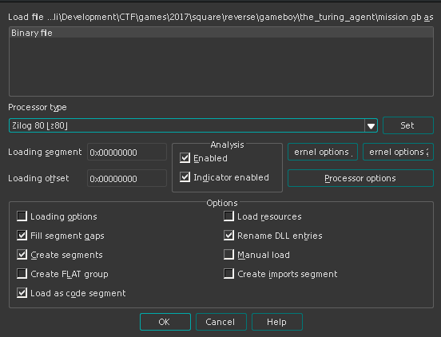
</p>

After this, you'll be faced with ROM and RAM parameters. I didn't change anything because IDA handled herself with this work.

<p align="center">
  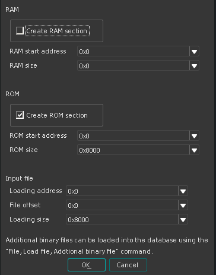
</p>

Let's examine the list of strings placed in this binary. We can find very interesting one:

<p align="center">
  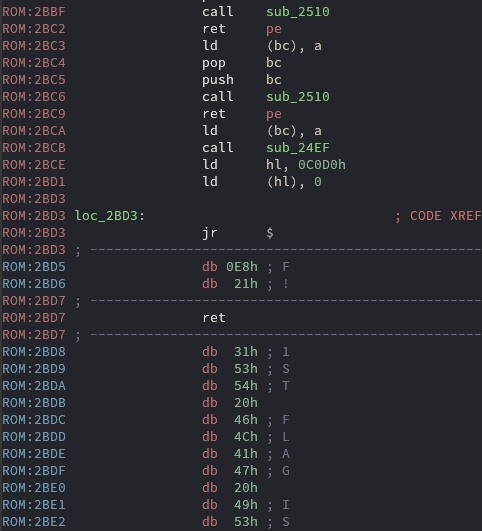
</p>

Actually, this is where we want to get. Okay, let's see a little above and find any xrefs:

<p align="center">
  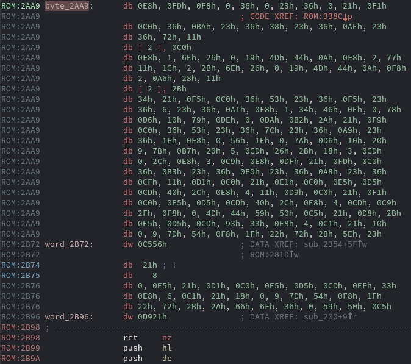
</p>

Oops, IDA can't disassemble these bytes. But don't be sad because of it. We still have the xref! This ```byte_2AA9``` is called from the next function:

<p align="center">
  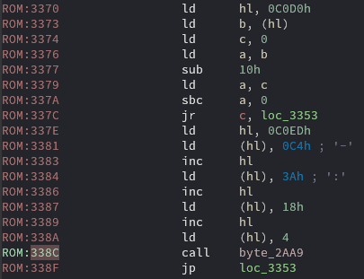
</p>

Now, we want to set the breakpoint at the ```0x338C``` address and see if this address is reachable from the code without any modifications. Let's run it. 

[_Omitted screen of reached and. Sorry, I'm lazy. You will see it on the next screen, I promise!_]

And yes, it's reachable. We are stepping in this function and see disassembled instructions (those IDA couldn't disassembly)

After several instructions below, we can see interesting ```and (hl)```.

### Little information about ```and``` in z80
```and val``` — this is template for ```and``` instruction. It ands ```A``` register with ```val``` and then puts obtained value in the ```A``` register.

Brackets in the z80 assembly is equal to brackets in x86 assembly — getting value under the address. So, our instruction takes value from ```hl``` address ands it with ```A``` register and put the value back into ```A``` register. Cool

Now let's set the breakpoint at this address and see what exactly this instruction ands.

<p align="center">
  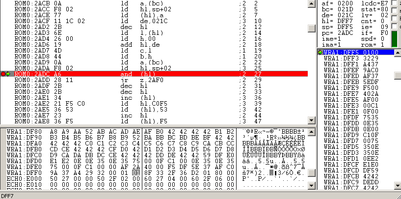
</p>

So, ```A = 0x2``` and ```(hl) = 0x1```. Doesn't it look very similiar? Yes, ```(hl)``` includes our transformed bytes from the input. But it's too early to make conclusions. Let's continue execution until new ```and```

<p align="center">
  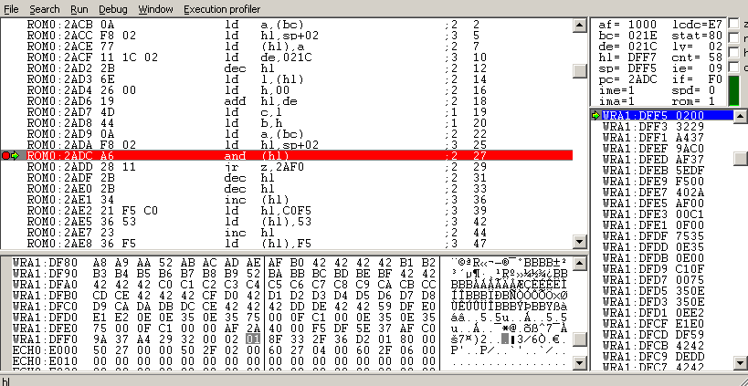
</p>

Yes, in the ```(hl)``` lays our transformed bytes one by one. One more loop:

<p align="center">
  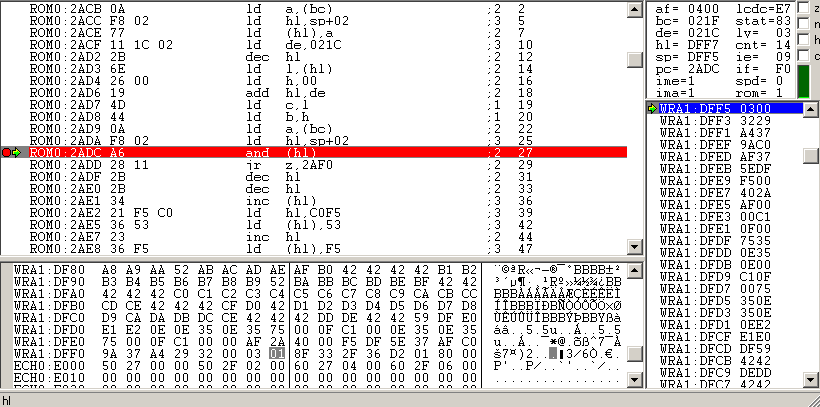
</p>

Okay, what do we have so far? This ```and``` ands bytes of transformed input and some bytes in ```A``` register. Bytes in ```A``` register correspond to the last table. It means, that our input checking takes place exactly in this instruction!

Next actions are obvious: Get all bytes from ```A``` register and input exactly this symbols. In the end, we will get the next:
- In bytes: ```0x8 0x2 0x10 0x4 0x20 0x10 0x4 0x8 0x8 0x10 0x4 0x1 0x2 0x1 0x20 0x8```
- In symbols: ```🡇🡄⌃🡅🢬⌃🡅🡇🡇⌃🡅🡆🡄🡆🢬🡇```

<p align="center">
  
</p>

And when we enter the last symbol we will get the flag!

<p align="center">
  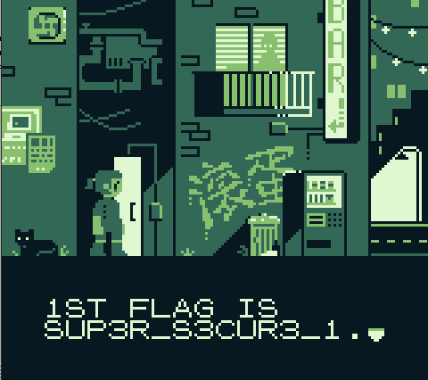
</p>

> flag-SUP3R-S3CUR3_1