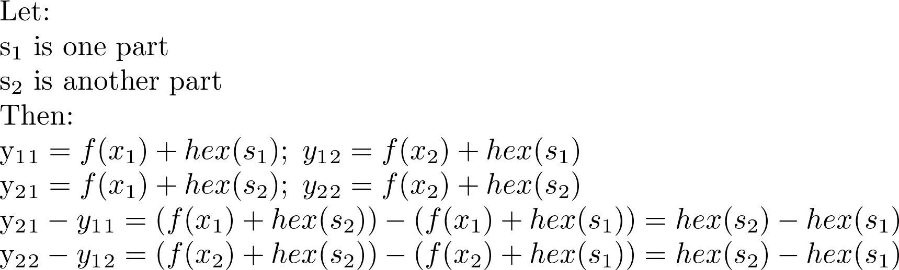

# __Timisoara CTF__ 
## _SSS Part 2_

## Information
**Category:** | **Points:** | **Writeup Author**
--- | --- | ---
Crypto | 250 | MiKHalyCH

**Description:** 

> [files](sss_part2.zip)

## Solution
This task is all about [bad realization](sss.py) of SSS algo. It uses same coefficients for different [splits](shares.txt).

If `f(x)` is [lagrange polynomial](https://en.wikipedia.org/wiki/Lagrange_polynomial), then each `y = f(x) + hex(flag_substring)`. 

    

It means that `y_21 - y_11 = y_22 - y_21`. We can compute `y_i` for each part, if we know `y_i` for just one part and difference between any results.

So let's calculate `y_1` for each part.

Yet we need to predict `f(x)` to decrypt each part of flag.

We know the first 7 bytes of flag: `timctf{`. We need to predict only 3 another.

[After several attempts](solver.py) I got the flag