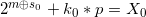
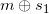
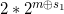
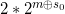
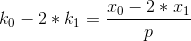
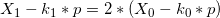
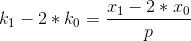

# __Tokyo Westerns CTF 3rd 2017.__ 
## _BabyDLP_

## Information
**Category:** Crypto
**Points:** 69
**Solves:** 91
**Description:** 
> Usually, Baby* is easy. **ppc2.chal.ctf.westerns.tokyo:28459**

[baby-dlp.7z](https://twctf2017.azureedge.net/attachments/baby-dlp.7z-0d3cc9d636e664e37fd628b723b121bcaeb514b857a324ebd01c6e1e734b31de)


## Solution

We need to solve equation like: <br/>

<br />
where:<br />
- __p__ is a big prime number; <br/>
- __m__ is our flag in bits; <br/>
- __s__ is our input <br/>
- __X__ is out output. <br/><br/>
We can only try to guess the bits of the flag using XOR one by one from the end of the binary number.<br />

The first step is the XORing with __0__ and __1__: <br/>
<br/>
 <br/><br/>

 and 
 differ only in the last bit. <br/>
If the last bit of __m__ is __0__, then  = 1 + , otherwise, 1 +  =  => <br/>
 =>  =  (__m__'s last bit is __0__) or  =  (__m__'s last bit is __1__) <br/><br/>
__0__)
 =>  <br/>
__1__)
 =>  <br/><br/>

Left parts are integers. It means right parts are integers too. Now we will find integer variant (__0__ or __1__) and save the result. <br/><br/>
Second step is to undestand how to find other bits. Now we will XOR number with __1(i-1 random bits)__ and __0(same i-1 random bits)__ to get results, which degrees differ only in i position and one result is  times larger. ( and otherwise)<br/><br/>
It takes a lot of memory and time to calculate multiplier. We've optimized this with modulus multiplying. <br/><br/>

Completed exploit:
```py
#!/usr/bin/env python3
from socket import socket

p = 160634950613302858781995506902938412625377360249559915379491492274326359260806831823821711441204122060415286351711411013883400510041411782176467940678464161205204391247137689678794367049197824119717278923753940984084059450704378828123780678883777306239500480793044460796256306557893061457956479624163771194201
E = 10e-8

def calc(mul, x1, x2):
  return abs((x1 - (mul * x2)%p) % p) < E , abs((x2 - (mul * x1)%p) % p) < E

res = ''
for i in range(260*16):
  mul = 2 if i == 0 else (mul**2 % p)
  a,b = map(lambda x: hex(int(x, 2))[2:].encode()+b'\r\n',('1'+res, '0'+res))
  
  with socket() as s:
    s.connect(('ppc2.chal.ctf.westerns.tokyo', 28459))
    s.send(a)
    a = s.recv(2048).strip()[2:].decode()
    s.send(b)
    b = s.recv(2048).strip()[2:].decode()
    
  a,b = map(lambda x:int(x, 16), (a,b))
  v1, v2 = calc(mul, a, b)
  if v1 and v2:
    print('WRONG!')
    print(res, v1, v2)
    exit()
  res = ('1' if not v1 else '0') + res
  print('res:', res)
```
