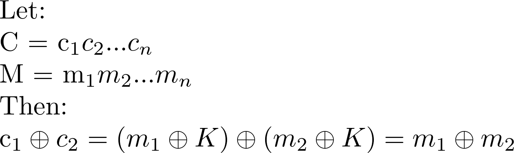
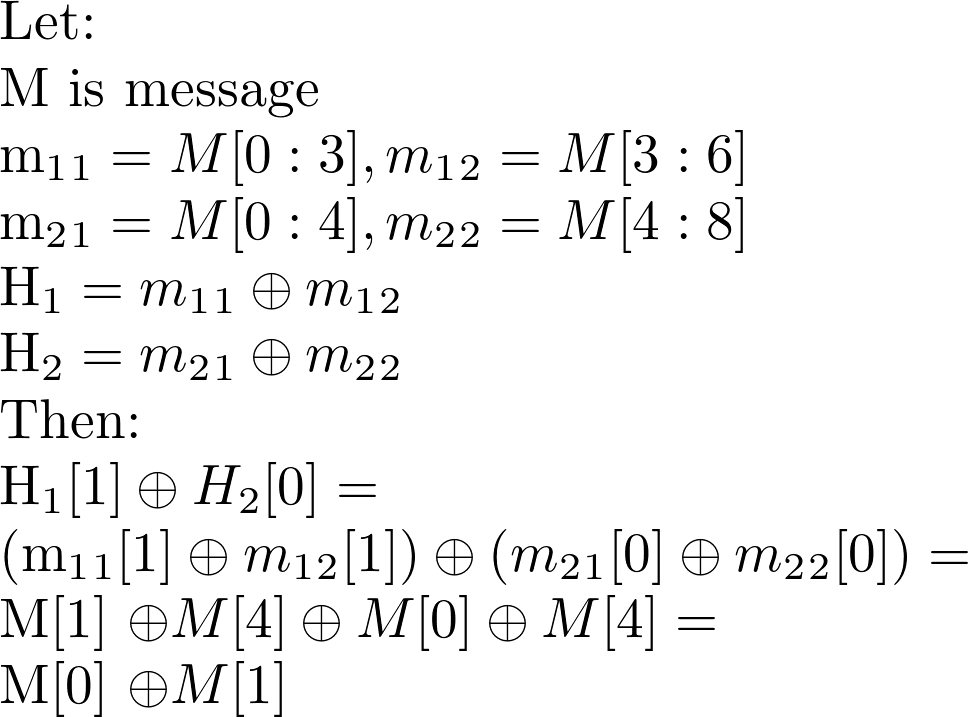

# __UIUCTF 2018__ 
## _xoracle_

## Information
**Category:** | **Points:** | **Writeup Author**
--- | --- | ---
Crypto | 200 | MiKHalyCH

**Description:** 

> Don't mind me, just trying out my new xor key generator
 nc challenges1.uiuc.tf 6464
 [xoracle.py](xoracle.py)

## Solution
1) Firstly we need to learn how to define key length. 
I make first query to server. This is the message which length I need: `C1`.
 
The length of `C1` is `1536 = 128 * 12`. The length of `K1` is between `128` and `255`. 
We can request `C2` with `K2`. 

  

If `K1 XOR K2` is consists of equal parts with lendth of `128-255` symbols, then `K1` and `K2` are keys with length of `K1 XOR K2` part. 
___
2) If we know length of `K` for some `C`, then:

    

This is the how I "remove" key from message Ciphertext. Message is XORed by itself
___
3) Let's take `C1` and `C2`, which keys (`K1` and `K2`) length differs only by 1. Remember that we can take any two XORed parts of `M`

    

Now we can calculate `M[0] XOR M[i]` for all `i` in `[1,128]`. 
___
4) Now we can brute first byte of message and restore next `127` bytes.  That's enough to restore key with length `128` and decrypt full message. 
 
___
5) Linux's `file` shows that if first byte is `0x50`, then decoded file is [zip archive](res.zip). But it's broken for `unzip`. Google recomends to use `jar xvf res.zip` and it works!
 
Inside archive it's half-broken [f.bmp](f.bmp) with flag. After some tries to send the flag task was done! 
 
 
Full solver is [here](solver.py)
___
*Thanks to Matt Dyas for this awesome task!*