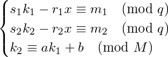
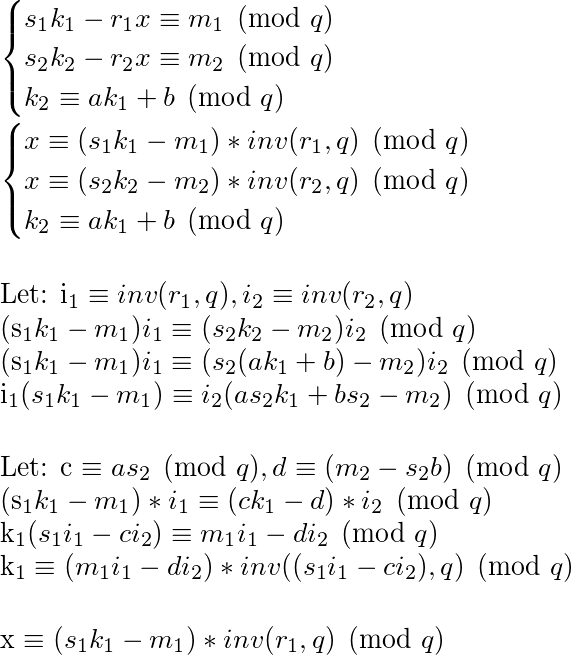

# __VolgaCTF 2018 Quals__ 
## Golden Nonsense

## Information
**Category:** | **Points:** | **Writeup Author**
--- | --- | ---
Crypto | 200 | MiKHalyCH

**Description:** 

> We've intercepted several consecutive signatures. Take everything you need and find the secret key. Send it to us in hex.
  
[task.py](task.py) [signatures](signatures)

## Solution
The code says that our algo is DSA-LCG. I've found best attack explanation at this [pdf](info.pdf)([link](https://link.springer.com/content/pdf/10.1007%2FBFb0052242.pdf)) 

To find `x` and `k1` we need to solve system of equations:

  

It's complicated if `q != M`. But in our task (SURPRISE!!!) `q == M`. That makes our challange much easier!
All we need is too solve system in `GM(q)`.

  

That's all is realized in [solver](solver.py)