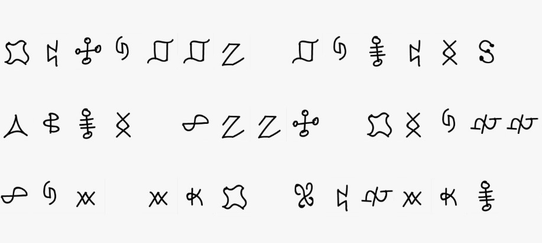
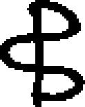
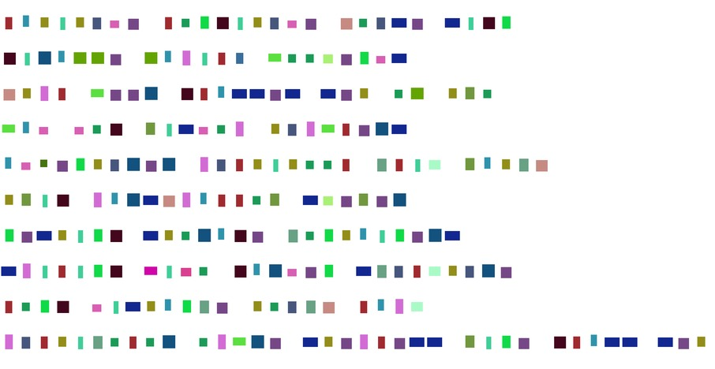

# Special Christmas Wishlist (50 PTS)

### Description

>While Santa was looking through the wishlists of the childern all around the world he came across a very strange looking one. Help Santa decode the letter in order to fulfill the wishes of this child.
>
>(Flag is Non-Standard)
>
>UPDATE: flag is lowercase!
>
>_Author: Gabies_

Files:
- [wishlish.png](wishlist.png)

Flag: ```xmasyouaresogoodatsubstitutionciphers```

### Solution

We've got an image with lots of drawn characters.    

<p></p>

Given image contains **73 lines** and every line looks like a text with some spaces between non-ASCII "words".

We can suppose that it is [Simple Substitution Cipher](https://en.wikipedia.org/wiki/Substitution_cipher), so we need to extract all symbols to solve the challenge.

But how to do it by hands? Rewriting 73 lines would be **harmful**.

Let's write a decoder that will extract black symbols from the white background.

Firstly we need to convert the image into `1-bit-pixel mode` with `dither=False`. After that our symbols will look more clearly:

<p></p>

Next I just moved from left to right, line by line, using [BFS](https://en.wikipedia.org/wiki/Breadth-first_search) to extract every symbol from image. All symbols are **continuous** so BFS will catch the entire symbol.

Here is an image where each unique symbol was replaced with a colored square.

<p></p>

The full script is available in [decode.py](decode.py). Now there are random ASCII characters instead of drawn symbols. The last line seems to be flag.

```
abcdcefgahijdcefgkhelgldji
jdmbnngnbodapqhhrgifl
kcoaqggmjabllgllgchncsh
qbffhjsdlfhoceoqagml
bftgicemgmoeacdchhauadvsbcuk
csdjobmlkobaahslrgsgm
iglcdijlchmbjguhicbdigml
lodadijwdxhjbmfgilueavcemg
ahijfdlcbiugcheukabov
oeacduhahmhoqmglcgoagllsdigjablllgc
vgfglcbawgsgampkhafgm
bmcdlbibaqboqhhlbacukglc
bemhmblobmcadjkcdijvbigal
ckglgblgmvgicjbmfgilueavcemg
ckgyedcgbobxdijyeglcnhmyegmdgl
mgupuagfjabllcmggjahqglmgabcdhilkdvl
igsphmrcdogluelchonmhicvbjgvexxag
ckgqglcladijqgtgmbjguhhagm
cmdhodzgfogcbalgbmmdijl
qdmckohicknahsgmigurabug
bohckgmlahtgdlqgphifogblemglvhhilgc
sgffdijsbacxvgmlhibadxgfbmc
vgmlhibadxgfjhhfidjkcadccagogqhhr
uelchovgcihlgvmdicigurabugl
uelchovgcvdaahsl
ysgmcprgpqhbmf
aabobmbobabmjgxdvvgmvheuk
odohlbfdbjmbojabllsbmglgchnckmgg
ckbirphenhmphemvbmcdiopwhemigpigurabug
phjbvhlgkbijdijlueavcemgl
ckgqdrgukbdiqhsa
umdolhikgbmceoqmgaab
ckgyedxdildfgckgobxg
ogilkgmqbasbmodijladvvgml
phemlodigbifhemlgijmbtgffgubicgmlgc
ckgbiidtgmlbmpwhemiba
ohoobqdmfuenn
sdigqbmmgajedcbmmbur
ckgvaelkhmjbil
jbmadujmbcgmbifhdafdvvdijfdlk
hrchqgmnglcbagqggmqmgsdijrdc
obcglnhmadng
qhhrahtgmladjkcsgdjkclubmtgl
uhilcdcecdhihneidcgflcbcglhnbogmdubjabll
jhanjabllglvgscgmbijgauhdillgchncsgatg
qeiipngacqbqpladvvgml
vgmlhibadxgfcmggcmeirjabllsbmgfeh
gzvgucdijphebrggvlbrgvmgjibiupwhemiba
ckgqgmmpqeffp
ckgqdmfdgpbmiqhsa
rbickbukbifgadgmlgbmmdijl
vgmlhibadxgfoptgmphsiibogqhhr
eiduhmibifmbdiqhsodlobcukgfgbmmdijl
lahckvbalohqdag
qbchibqmbiuk
vgmlhibadxgfueccdijqhbmf
lohrgfgcguchmfgbucdtbcdhichsga
ckgaeigadjkc
vgmlhibadxgfbiidtgmlbmpvelkvdielbobv
ogilcbuhlhurl
gashhfckgeiduhmiugmgbaqhsa
ckgadccagvbcdgic
udmuaghnnbodapbifnmdgifllgmtdijqhsa
jabllnahsgmjbmfgiugicgmvdgug
qdmcklchigodigmbalhbvl
lgchnnhemjhanjabllgl
ckgugfbmckeoqvdbihl
uelchoobvuhblcgmlgc
qdjvgmlhibadcpfglrldjil
lgblchiglvablklvhijgkhafgm
phemohlcfgldmgfhqwgucckdlukmdlobl
ckgnabjdl
zoblphebmglhjhhfbcleqlcdcecdhiudvkgml
```

Finally we should perform [Frequency analysis](https://en.wikipedia.org/wiki/Frequency_analysis) and recover the original message.

```
latitude longitude house sign giraffe family book ends html beer glasses set of two bad dog wisdom tumblers adventurer multi tool clip watch twig marsh mallow skewer nesting storage containers smiling jizo garden sculpture long distance touch lamp multi color ombre stem less wine glass set pedestal jewelry holder artisan al bamboo salt chest aurora smart lighting panels the sea serpent garden sculpture the quite amazing quest for queries recycled glass tree globes relationships new york times custom front page puzzle the best sling beverage cooler trio mixed metals earrings birth month flower necklace a mothers love is beyond measure spoon set wedding waltz personalized art personalized good night little me book custom pet nose print necklaces custom pet pillows qwerty keyboard llama rama large zipper pouch mimosa diagram glass ware set of three thank you for your part in my journey necklace yoga pose hanging sculptures the bike chain bowl crimson heart umbrella the quiz inside the maze mens herbal warming slippers yours mine and ours engraved decanter set the anniversary journal momma bird cuff wine barrel guitar rack the plush organs garlic grater and oil dipping dish oktober festale beer brewing kit mates for life book lovers lightweights carves constitution of united states of america glass golf glasses pewter angel coins set of twelve bunny felt baby slippers personalized tree trunk glass ware duo expecting you a keepsake pregnancy journal the berry buddy the birdie yarn bowl kantha chandeliers earrings personalized my very own name book unicorn and rainbow mismatched earrings sloth pals mobile baton a branch personalized cutting board smoke detector deactivation towel the lune light personalized anniversary push pinus a map mens taco socks elwood the unicorn cereal bowl the little patient circle of family and friends serving bowl glass flower garden centerpiece birth stone mineral soaps set of four golf glasses the cedar thumb pianos custom map coaster set big personality desk signs sea stone splash sponge holder your most desired object this chrism as the flag is xmas you are so good at substitution ciphers
```
