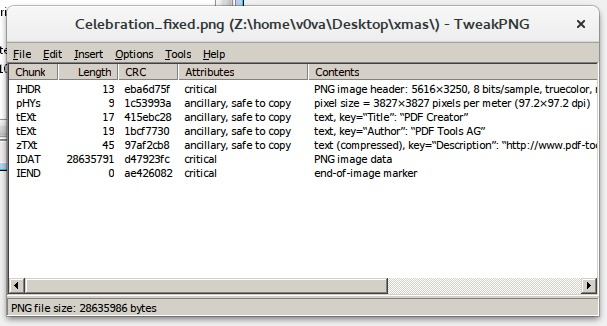
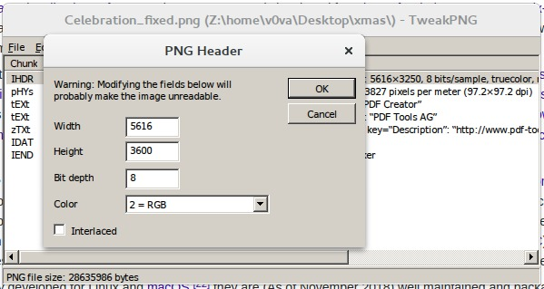

# Hidden in almost plain sight (401 PTS)

### Description

>A strange file was sent to Santa's email address and he is puzzled. Help him find what's wrong with the file and you can keep any flag you find in the process.
>
>_Author: Googal_

Files:
- [Celebration](https://drive.google.com/file/d/1JiGT9HxVp83dSv_FAuFYfKPCEPDaGmju/edit)

Flag: ```X-MAS{who_knows_wh3re_s4anta_hid3s_the_g1fts}```

### Solution

Firstly we need to determine a type of the "strange file". 

```sh
$ file Celebration 
Celebration: data
```

The famous `file` utility doesn't help us, so let's do it manually!  

```sh
$ xxd Celebration | head
00000000: 8900 0047 0d0a 1a0a 0000 000d 4948 4452  ...G........IHDR
00000010: 0000 15f0 0000 0cb2 0802 0000 00eb a6d7  ................
00000020: 5f00 0000 0970 4859 7300 000e f300 000e  _....pHYs.......
00000030: f301 1c53 993a 0000 0011 7445 5874 5469  ...S.:....tEXtTi
00000040: 746c 6500 5044 4620 4372 6561 746f 7241  tle.PDF CreatorA
00000050: 5ebc 2800 0000 1374 4558 7441 7574 686f  ^.(....tEXtAutho
00000060: 7200 5044 4620 546f 6f6c 7320 4147 1bcf  r.PDF Tools AG..
00000070: 7730 0000 002d 7a54 5874 4465 7363 7269  w0...-zTXtDescri
00000080: 7074 696f 6e00 0008 99cb 2829 29b0 d2d7  ption.....())...
00000090: 2f2f 2fd7 2b48 49d3 2dc9 cfcf 29d6 4bce  ///.+HI.-...).K.
```

`IHDR`, `pHYs`, `tEXt` suggest us the correct file type: [PNG](https://en.wikipedia.org/wiki/Portable_Network_Graphics). These **chunk names**, especially `IDHR`, are well-known by all stegano/forensics CTF players.

According to the [format specification](https://www.w3.org/TR/PNG/), the first 8 bytes of PNG image file _always contain the following (decimal) values_:

```
[137, 80, 78, 71, 13, 10, 26, 10]

[0x89, 0x50, 0x4e, 0x47, 0x0d, 0x0a, 0x1a, 0x0a]

'\x89PNG\r\n\x1a\n'
```

After comparison with the given file, we can find the difference: two zero bytes instead of `PN` at the start! So, I can't wait any more, let's fix that!

```sh
$ xxd Celebration_fixed | head -1
00000000: 8950 4e47 0d0a 1a0a 0000 000d 4948 4452  .PNG........IHDR
$ file Celebration_fixed 
Celebration_fixed: PNG image data, 5616 x 3250, 8-bit/color RGB, non-interlaced
```

Good job! Now, opening the image...

<p></p>

Okay, there is a big magenta rectangle in the center. And we have no chances to look behind it.

It's the _deep forensics_ time!

[TweakPNG](http://entropymine.com/jason/tweakpng/) is a Windows utility for a PNG files inspection. We can use it directly or through [Wine](https://en.wikipedia.org/wiki/Wine_(software)).

<p></p>

We can perform a manipulation of all PNG chunks and their content. After some guessing I've tried to change the image's height, so PNG size was changed from `5616x3250` to `5616x3600`.

<p></p>

Save the image as `Celebration_fixed_resized.png` and open it in viewer:

<p></p>
