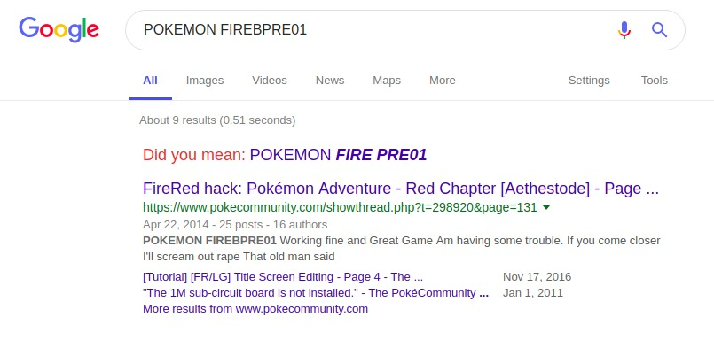
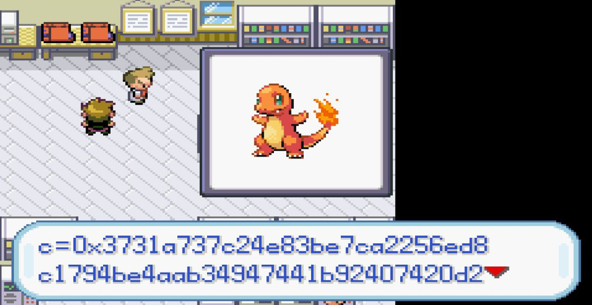
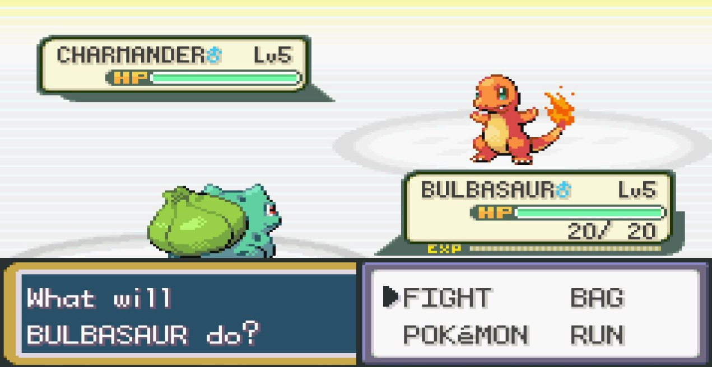

# Unown Gift (487 PTS)

### Description

>Oh, how sweet, you've just received a gift from someone! Sadly, you can't really wrap your head around how it's supposed to be opened...
>
> _Authors: Milkdrop + Gabies + PinkiePie1189_

Files:
- [UnownGift](https://drive.google.com/file/d/1E_7RIesgsxljZlinuAH7KbVaSmmVwv-h/edit)

Flag: ```X-MAS{Wh4t_4n_un3xp3ct3d_chr1stm45_pr3s3nt}```

### Solution

Given file is quite large and it isn't recognizable by `file` utility.

```sh
$ file UnownGift 
UnownGift: 8086 relocatable (Microsoft)
```

Binwalk also can't detect anything inside the file.

_MySQL indexes are useless (according to forensics experience)._

```sh
$ binwalk -B UnownGift 

DECIMAL       HEXADECIMAL     DESCRIPTION
--------------------------------------------------------------------------------
4885395       0x4A8B93        MySQL MISAM index file Version 5
4919714       0x4B11A2        MySQL MISAM index file Version 10
4980609       0x4BFF81        MySQL MISAM index file Version 6
4980819       0x4C0053        MySQL ISAM compressed data file Version 7
4983414       0x4C0A76        MySQL MISAM index file Version 10
4986575       0x4C16CF        MySQL MISAM index file Version 3
4987191       0x4C1937        MySQL MISAM index file Version 7
5006628       0x4C6524        MySQL MISAM index file Version 2
5012426       0x4C7BCA        MySQL MISAM index file Version 5
5017673       0x4C9049        MySQL MISAM compressed data file Version 5
5236947       0x4FE8D3        MySQL MISAM compressed data file Version 11
7026558       0x6B377E        MySQL MISAM compressed data file Version 9
13935161      0xD4A239        MySQL ISAM compressed data file Version 3
```

What can we do with this **extremely** strange file? Let's try XOR!

Firstly I tried to XOR the blob with every byte from `range(256)` consistently, but it was taking **too long** time due to the large file size (16 Mb).

So I've turned on a _guessing ability_ and got the correct byte: `0xFF`.

```sh
$ file UnownGift_XORed 
UnownGift_XORed: data
```

Ok, now `file` completely doesn't know the file type, but let's look at `strings`

```sh
$ strings UnownGift_XORed -n 10
POKEMON FIREBPRE01
pokemon red version
...
C:/WORK/POKeFRLG/src/pm_lgfr_ose/source/gflib/malloc.c
C:/WORK/POKeFRLG/src/pm_lgfr_ose/source/fieldmap.c
C:/WORK/POKeFRLG/src/pm_lgfr_ose/source/evobjmv.c
C:/WORK/POKeFRLG/src/pm_lgfr_ose/source/scrcmd.c
C:/WORK/POKeFRLG/src/pm_lgfr_ose/source/scr_tool.c
C:/WORK/POKeFRLG/src/pm_lgfr_ose/source/rfu.c
...
```

After some googling we can find similar file, it is [Pokemon FireRed](http://pokemon.wikia.com/wiki/Pokémon_FireRed_and_LeafGreen_Version) adventure game.

<p></p>

Ok, so `UnownGift_XORed` is [GBA](https://en.wikipedia.org/wiki/Game_Boy_Advance) ROM image, but it's differ with the original game. 

I used [Visual Boy Advance](https://en.wikipedia.org/wiki/VisualBoyAdvance) for GameBoy emulation, and the challenge becomes really beautiful!

<p></p>

Instead of pokemons world, we appear in [Lapland](https://en.wikipedia.org/wiki/Lapland)!

We need to make a little walk around the location. In one of these houses we'll find three pokeballs

<p></p>
<p></p>

Each pokeball contains a single number, they called `n`, `c` and `e`. It's very similar to [RSA](https://en.wikipedia.org/wiki/RSA_(cryptosystem)) cryptosystem.

```py
n=0x919988e16d5192c24b43f1c7b51856b5e56789aa3fc0d3b820500dde307e414b1dd3525e19340cbc895a34b0cae3db

c=0x3731a737c24e83be7ca2256ed8c1794be4aab34947441b92407420d25c6ad5b4966ab3b6ae0afbf0a2be2087e3cb

e=0x9ed98456b3387cafe1439783724eb683b2434c4cdf387a3267f8421719e12fd1ccdb7fdca650afea6a42deebe21e1
```

So, we've got RSA and we need to crack it. Since `e` is quite large, let's try [Wiener's attack](https://en.wikipedia.org/wiki/Wiener%27s_attack).

```py
>>> d = wiener_attack(e, n)
Hacked!
>>> long_to_bytes(d)
b'why?!'
>>> m = pow(c, d, n)
>>> long_to_bytes(m)
b'X-MAS{Wh4t_4n_un3xp3ct3d_chr1stm45_pr3s3nt}'
>>>
```

And that is the flag! I used [this repository](https://github.com/pablocelayes/rsa-wiener-attack) to perform the attack.

Also, the game has Pokemon battles!

<p></p>
