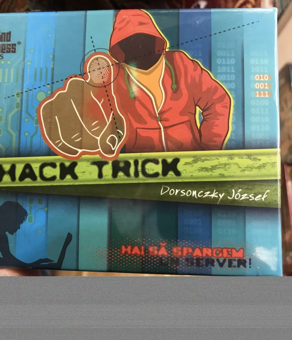
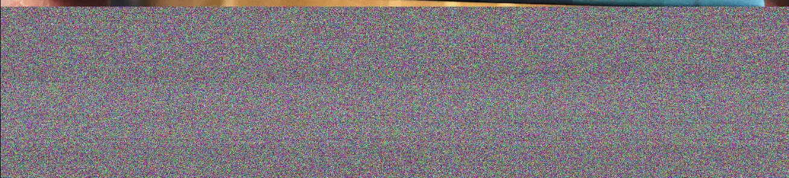

# Suspicious Hacking Game (468 PTS)

### Description

>You woke up on Christmas Day only to find this lame hacking game cartridge laying under the Christmas tree. You are certain that you were an ethical hacker this year, though, and you deserve something better. Maybe Santa has left you another present you aren't yet aware of?
>
>_Authors: PinkiePie1189 + Milkdrop_

Files:
- [suspicious.png](https://drive.google.com/file/d/1HRBkXzI_RtJIpWP1F7Gz-1p7rbTUHkM3/edit)

Flag: ```X-MAS{S4v3_Th1s_1m4g3_4nd_g3t_4_fr33_g4m3}```

### Solution

<p></p>

Hacker in the hood! And he said something about `hack tricks`!

Should we use our _stegano skills_ to reveal the secret? Yes, of course!

Look at the bottom, there is a strange colored noise.

<p></p>

And if you look more carefully, you will see repeating horizontally lines. It completely doesn't look like a random noise!

But we are absolutely not able to see that noise directly in PNG file, since PNG format performs loseless compression.

How to decompress a PNG image? One of the simplest ways is convert the image to format that doesn't implement any compression: [BMP format](https://en.wikipedia.org/wiki/BMP_file_format).

```sh
$ convert suspicious.png suspicious.bmp
$ file suspicious.bmp 
suspicious.bmp: PC bitmap, Windows 98/2000 and newer format, 6000 x 6974 x 24
```

Without compression the image size becomes three times large, but we still can use `binwalk` utility.

```sh
$ binwalk -B suspicious.bmp 

DECIMAL       HEXADECIMAL     DESCRIPTION
--------------------------------------------------------------------------------
138           0x8A            7-zip archive data, version 0.4
173           0xAD            Zip archive data, at least v2.0 to extract, compressed size: 1877, uncompressed size: 4608, name: assets/bin/Data/Managed/Assembly-CSharp.dll
2143          0x85F           Zip archive data, at least v2.0 to extract, compressed size: 116892, uncompressed size: 293376, name: assets/bin/Data/Managed/Mono.Security.dll
702655        0xAB8BF         Zip archive data, at least v2.0 to extract, compressed size: 36537, uncompressed size: 84992, name: assets/bin/Data/Managed/UnityEngine.Timeline.dll
739286        0xB47D6         Zip archive data, at least v2.0 to extract, compressed size: 99198, uncompressed size: 247296, name: assets/bin/Data/Managed/UnityEngine.UI.dll
838578        0xCCBB2         Zip archive data, at least v2.0 to extract, compressed size: 510452, uncompressed size: 1640960, name: assets/bin/Data/Managed/UnityEngine.dll
```

Woah, it's just a [7z archive](https://en.wikipedia.org/wiki/7z)! Let's decompress it.

```sh
$ 7z x suspicious.bmp 

7-Zip [64] 9.20  Copyright (c) 1999-2010 Igor Pavlov  2010-11-18
p7zip Version 9.20 (locale=en_US.UTF-8,Utf16=on,HugeFiles=on,4 CPUs)

Processing archive: suspicious.bmp

Extracting  Game.apk

Everything is Ok

Size:       24356996
Compressed: 125532138
```

So, we've got an [APK](https://en.wikipedia.org/wiki/Android_application_package) file, perhaps it is an Android game. 

<p></p>

The game interface is very simple, we can only tap to the screen. We need to tap **50000** times to get the flag.

<p></p>

It will take a very long time, so we need to perform a some kind of reverse engineering. I used [online decompiler](http://www.javadecompilers.com/apk) to decompile the apk.

```sh
$ ls -1F
AndroidManifest.xml
apktool.yml
assets/
lib/
original/
res/
resources/
sources/
```

Firsly I started to inspect _java_ files and found nothing there. I have found an interesting file `assets/bin/Data/data.unity3d`, but it didn't contain the flag. 

At the same time my teammate was investigating binary files from `assets/bin/Data/Managed` directory and found the flag in one of the dll's:

```sh
$ ls -1F
Assembly-CSharp.dll
Mono.Security.dll
mscorlib.dll
System.Core.dll
System.dll
UnityEngine.dll
UnityEngine.Networking.dll
UnityEngine.Timeline.dll
UnityEngine.UI.dll

$ strings -el Assembly-CSharp.dll | head
Taps Till Next Letter: 
X-MAS{S4v3_Th1s_1m4g3_4nd_g3t_4_fr33_g4m3}
VS_VERSION_INFO
VarFileInfo
Translation
StringFileInfo
007f04b0
Comments
CompanyName
FileDescription
```

`-el` argument to `strings` command is used to set the correct **two-bytes little-endian** encoding.
