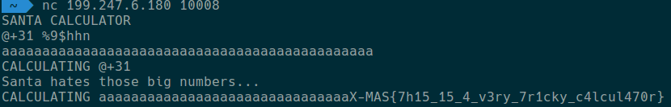

# __X-MAS CTF 2018__
## _The Calculator_

## Information
**Category:** | **Points:** | **Writeup Author**
--- | --- | ---
Pwn | 495 | a1exdandy

**Description:** 

>Here is some strange calculator that is used by Elves, but it seems very poorly implemented. Could you take a look if it is secure?
>
>Download [chall](files/part1/chall)
>
>Running on: nc 199.247.6.180 10008
>
>Author: littlewho

## Solution

We have the binary with the format-string vulnerability, but input is restricted for only `%n` and modifications (`%N$n`, `%N$hn` and so on for an integer `N`).
Also, we have a calculator that can perform `+`, `-`, `<`, `=`, `>`, `#` (put value into `register1`), `$` (put value into `register2`), `@` (get value from `register2`), `!` (get value from `register1`) operations. The result of the expression can be distinguished if only it equals `0` or `1`. (`Santa hates those big numbers...`).
We can put some complex expressions, e.g. `1 + 2 + 3 + 4`, and all intermediate calculations will be on a stack after that.
Also, `register2` contains a buffer address at the startup. So, we can put a non-zero value into `buffer[31]` to leak the flag.

Final solution is:

```
@+31 %9$hhn
aaaaaaaaaaaaaaaaaaaaaaaaaaaaaaaaaaaaaaaaaaaaaa
```



## _The Calculator 2.0_

## Information
**Category:** | **Points:** | **Writeup Author**
--- | --- | ---
Pwn | 497 | a1exdandy

**Description:** 

>I know you pwned it last time, but it was too easy. Could you give it another shot?
>
>Download [chall](files/part2/chall)
>
>Running on: nc 199.247.6.180 10009
>
>Author: littlewho

## Solution

Now, we can't use `register2` in our calculations. But we can comapre it with `<`, `=`, `>`, so, with the binary search we can find the buffer address and then use the same method as in the first part. But we can't use 64-bit register directly. So, first of all, we load a constant part of the 64-bit buffer address into `register1`, then compare `register2` with `register1` + `some interesting value`.

To put the constant part of the buffer address into register I use the next expressions:
```
2147221504 + 2147221504 #
!+!+!+!+!+!+!+!#
!+!+!+!+!+!+!+!#
!+!+!+!+!+!+!+!#
!+!+!+!+!+!+!+!#
!+!+!+!+!+!+!+!#
```

After this expressions we have `0x7ffc00000000` inside of `register1`. Then we check if `register2` in the bound `[register1 + 0, register2 + MAX_INT]` and if it's true, we can find the buffer address with the binary search (let's it be `X`). After that, to put a non-zero value into buffer[31], we can use `!+X+31 %%10$hhn`

[Final solution](files/satanic_calculator_pt2.py)

>Ave Satani! <3
