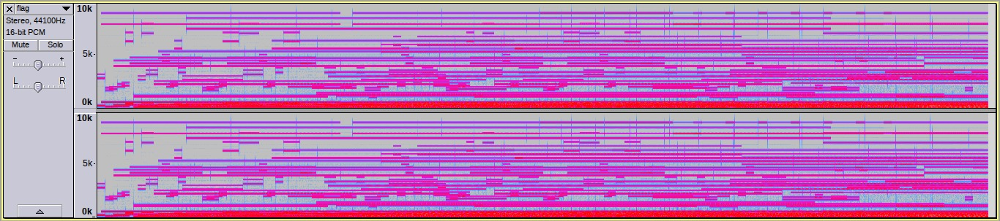
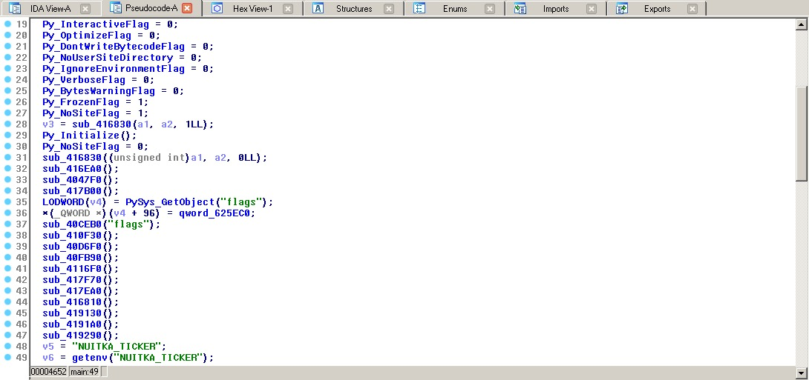

# A Christmas Carol (454 PTS)

### Description

>Santa found an interesting machine that transforms text to beautiful Christmas carols. He also found a carol that contains a hidden message. Help Santa find out what the secret message is!
>
>_Authors: littlewho + Gabies_

Files:
- [carol.zip](carol.zip)

Flag: ```X-MAS{4_n07_50_u5u4l_chr157m45_c4r0l}```

### Solution

We've got two files: the encoder and the flag, encoded by given encoder (yeah!).

```sh
$ file encoder.exe 
encoder.exe: ELF 64-bit LSB executable, x86-64, version 1 (SYSV), dynamically linked, interpreter /lib64/ld-linux-x86-64.so.2, for GNU/Linux 3.2.0, BuildID[sha1]=f51f0d393d69dc03ad75319591f25174696c6ac0, stripped
$ file flag.mid 
flag.mid: Standard MIDI data (format 1) using 1 track at 1/220
``` 

Midi file looks a bit strange and sounds too. 

<p></p>

Okay, let's _reverse_ the binary!

```sh
$ ./encoder.exe 
Usage: ./exe <infile> <outfile>
$ echo ABC > file
$ ./encoder.exe file file.mid
[*] Encoding ABC

[*] Written message to file.mid
```

I tried to open the binary in [IDA Pro](https://en.wikipedia.org/wiki/Interactive_Disassembler)...

<p></p>

and it actually was an **executable python**, using [Nuitka](https://github.com/Nuitka/Nuitka) as a compiler.

I don't know how to reverse compiled python, so I started to investigate the _behaviour_ of the encoder.

Firstly I ran `strace` utility ([strace.txt](strace.txt)) and found that encoder works on **python2** and imports **base64** library (also, it uses **midi** library to save midi's).

```
stat("/usr/lib/python2.7/", {st_mode=S_IFDIR|0755, st_size=20480, ...}) = 0
stat("/usr/lib/python2.7/", {st_mode=S_IFDIR|0755, st_size=20480, ...}) = 0
...
stat("/usr/lib/python2.7/base64", 0x7fff59651ba0) = -1 ENOENT (No such file or directory)
open("/usr/lib/python2.7/base64.x86_64-linux-gnu.so", O_RDONLY) = -1 ENOENT (No such file or directory)
open("/usr/lib/python2.7/base64.so", O_RDONLY) = -1 ENOENT (No such file or directory)
open("/usr/lib/python2.7/base64module.so", O_RDONLY) = -1 ENOENT (No such file or directory)
open("/usr/lib/python2.7/base64.py", O_RDONLY) = 3
open("/usr/lib/python2.7/base64.pyc", O_RDONLY) = 4
```

According to [python2.7's import system](https://docs.python.org/2/tutorial/modules.html), python tries to search for the module in the working directory. It means, we can intercept dependency resolution and create our own `base64.py` in the same folder as `encoder.exe`.

```sh
$ touch base64.py
$ ./encoder.exe file file.mid 
Traceback (most recent call last):
  File "/home/littlewho/our_ctf/midi/chall.py", line 2, in <module>
ImportError: cannot import name 'b64encode'
```

Oops, python can't import required functions (cause we didn't implement it). Let's fix that!

```sh
$ cat base64.py
def b64encode(x):
    print '(from b64encode): '+x; return x
$ ./encoder.exe file file.mid 
[*] Encoding ABC

(from b64encode): ABC

[*] Written message to file.mid
```

Okay, it works, but isn't helpful for us. It just base64-encode a file content, very usual procedure.

Next, I placed a fake `midi.py` and started to learn it's behaviour.

```sh
$ touch midi.py
$ ./encoder.exe file file.mid 
...
AttributeError: 'module' object has no attribute 'Pattern'

$ cat midi.py
class Pattern: pass
$ ./encoder.exe file file.mid 
...
AttributeError: 'module' object has no attribute 'Track'

$ cat midi.py
class Pattern: pass
class Track: pass
$ ./encoder.exe file file.mid 
...
AttributeError: Pattern instance has no attribute 'append'

$ cat midi.py
class Pattern(list): pass
class Track(list): pass
$ ./encoder.exe file file.mid 
...
AttributeError: 'module' object has no attribute 'NoteOnEvent'

$ cat midi.py
class Pattern(list): pass
class Track(list): pass
def NoteOnEvent(*args, **kwargs): print 'from midi: '+repr(args)+repr(kwargs)
$ ./encoder.exe file file.mid 
...
AttributeError: 'module' object has no attribute 'NoteOffEvent'

$ cat midi.py
class Pattern(list): pass
class Track(list): pass
def NoteOnEvent(*args, **kwargs): print 'from midi: '+repr(args)+repr(kwargs)
def NoteOffEvent(*args, **kwargs): print 'from midi: '+repr(args)+repr(kwargs)
$ ./encoder.exe file file.mid 
[*] Encoding ABC

(from b64encode): ABC

from midi: (){'velocity': 20, 'tick': 0, 'pitch': 32}
from midi: (){'tick': 100, 'pitch': 33}
from midi: (){'velocity': 20, 'tick': 0, 'pitch': 33}
from midi: (){'tick': 100, 'pitch': 33}
from midi: (){'velocity': 20, 'tick': 0, 'pitch': 33}
from midi: (){'tick': 100, 'pitch': 34}
from midi: (){'velocity': 20, 'tick': 0, 'pitch': 5}
from midi: (){'tick': 100, 'pitch': 5}
Traceback (most recent call last):
  File "/home/littlewho/our_ctf/midi/chall.py", line 51, in <module>
  File "/home/littlewho/our_ctf/midi/chall.py", line 29, in encode_message
AttributeError: 'module' object has no attribute 'EndOfTrackEvent'
```

`velocity` and `tick` arguments are always the same, but `pitch` makes changes. We need to look more carefully. I changed a bit `midi.py` to see a difference better

```py
class Pattern(list): pass
class Track(list): pass

def NoteOnEvent(*args, **kwargs): print 'on='+str(kwargs['pitch']),
def NoteOffEvent(*args, **kwargs): print 'off='+str(kwargs['pitch'])
```

Let's start investigation!

```sh
$ echo AAA > file && ./encoder.exe file file.mid 
on=32 off=33
on=32 off=33
on=32 off=33
on=5 off=5

$ echo AAB > file && ./encoder.exe file file.mid 
on=32 off=33
on=32 off=33
on=33 off=33
on=5 off=5

$ echo ABCZ > file && ./encoder.exe file file.mid 
on=32 off=33
on=33 off=33
on=33 off=34
on=45 off=45
on=5 off=5
```

See that? It looks like `on+off` pitches give the number of the character in ASCII table. The last character is line feed `\n`.

```py
>>> chr(32+33), chr(33+33), chr(33+34), chr(45+45), chr(5+5)
('A', 'B', 'C', 'Z', '\n')
```

Yeah, we've finally got it! All that we should do now is to extract all pitches from `flag.mid`.

```py
>>> import midi
>>> flag = midi.read_midifile('flag.mid')
>>> track = flag[0]
>>> track[0]
midi.NoteOnEvent(tick=0, channel=0, data=[42, 20])
>>> on_events, off_events = track[0::2], track[1::2]
>>> on_pitches = [event.data[0] for event in on_events[:-1]]
>>> off_pitches = [event.data[0] for event in off_events[:-1]]
>>> chars = []
>>> for on, off in zip(on_pitches, off_pitches):
...     chars.append(on+off)
... 
>>> ''.join(map(chr, chars))
'TyBDaHJpc3RtYXMgdHJlZSwgbyBDaHJpc3RtYXMgdHJlZQpIb3cgbG92ZWx5IGFyZSB0aHkgYnJhbmNoZXMKTyBDaHJpc3RtYXMgdHJlZSwgbyBDaHJpc3RtYXMgdHJlZQpIb3cgbG92ZWx5IGFyZSB0aHkgYnJhbmNoZXMKWC1NQVN7NF9uMDdfNTBfdTV1NGxfY2hyMTU3bTQ1X2M0cjBsfQ='
```

And the last move...

```
O Christmas tree, o Christmas tree
How lovely are thy branches
O Christmas tree, o Christmas tree
How lovely are thy branches
X-MAS{4_n07_50_u5u4l_chr157m45_c4r0l}
```
