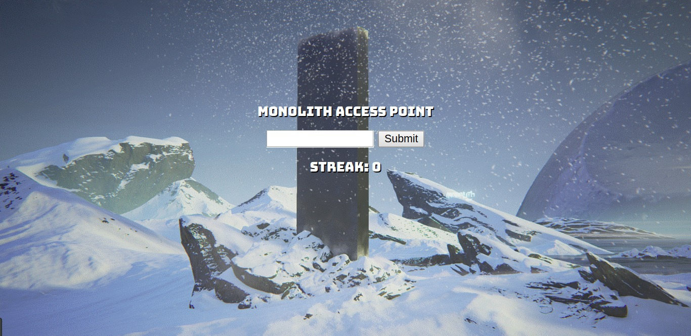
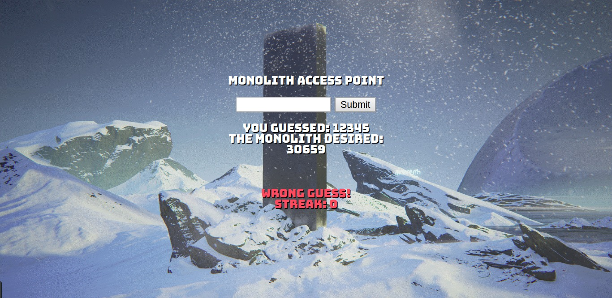
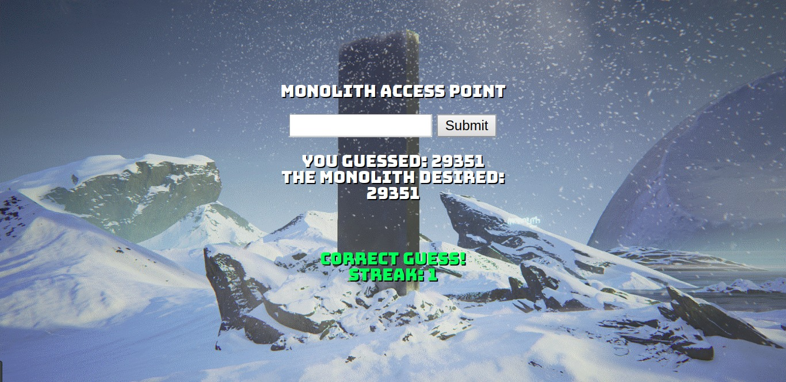
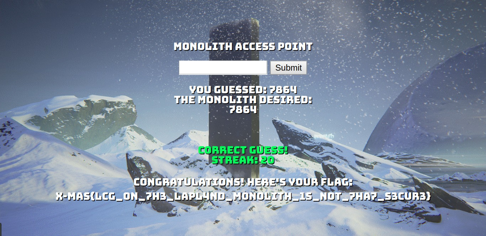

# Let's Crack the Great lapland monolith (421 PTS)

### Description

>"Psst, I got a task for you. There's this monolith to which I need to get access, but I can't get the numbers right. Can you help me? I pay well." ~ A shady dealer gnome
>
>_Authors: Milkdrop + Gabies_

Links:
- Server: [http://199.247.6.180:12000](http://199.247.6.180:12000)

Flag: ```X-MAS{LCG_0n_7h3_LapL4nd_m0n0LiTh_1s_n0t_7ha7_s3cur3}```

### Solution

#### This solution is unintended! Intended solution is described in [the second part](../Let%27s%20Crack%20the%20Greater%20lapland%20monolith/README.md).

<p></p>

Website contains a single input field sending a given number to the server. Also it holds user's session in cookie `PHPSESSID`.

<p></p>

We need to get _guess streak_, but I'm not enough lucky to catch even 1 correct guess. And we don't even know the type of the random generator.

Since [all PRNG's are periodic](https://cs.stackexchange.com/q/24420), we can try to **determine the period** of the number generator.

The website prints each generated number, so let's generate some numbers from the same session and get the output. If we could receive certain number twice, we'll detect generator's period.

I wrote a simple [python script](solver.py) for that. It was worked for a few minutes and printed:

```sh
FOUND PERIOD: 22530
PHPSESSID=27734bdc6ce06142d374b1c613d18c9d
NEXT 20 NUMBERS ARE:
29351
18266
14081
1
25417
38732
33515
35021
16992
26161
21208
1960
7620
41952
13877
32424
17353
29529
6321
7864
```

Ok, let's try to send these numbers to Monolith. Don't forget to change `PHPSESSID`!

<p></p>

It works! After the sending of 20 _guessed_ numbers we'll receive the flag:

<p></p>

And also we've got the type of PRNG from the flag's text: [Linear congruential generator](https://en.wikipedia.org/wiki/Linear_congruential_generator).
