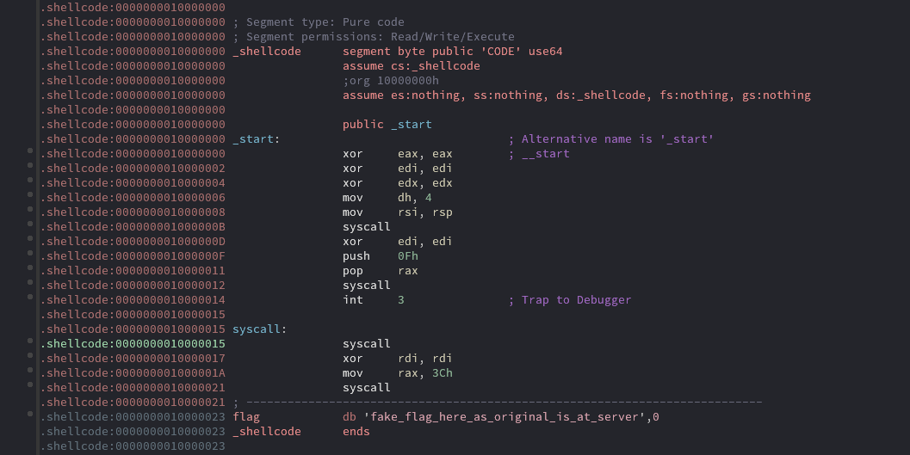
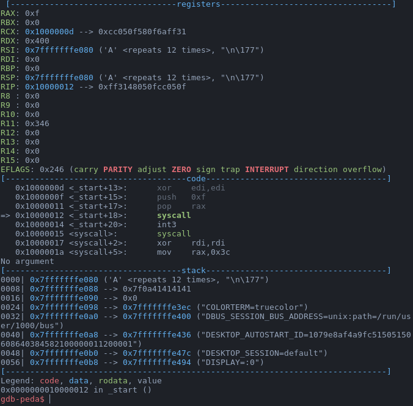
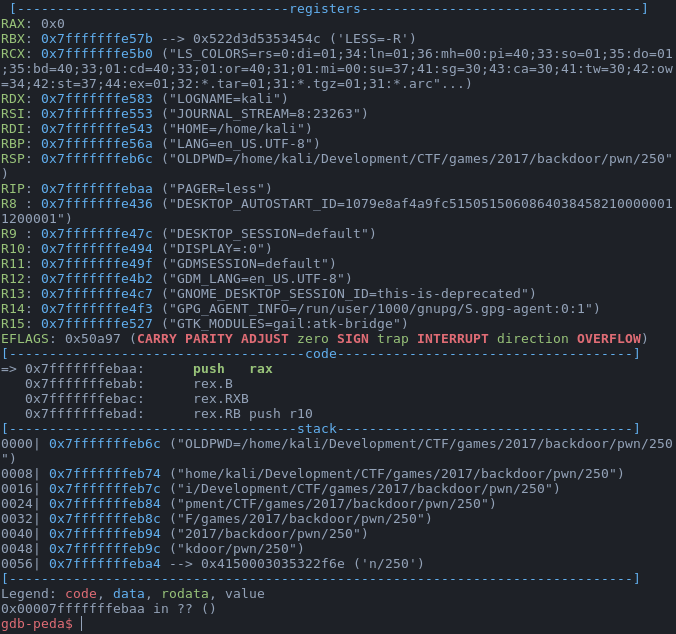

The task consists of one [64-bit binary](player_bin). Let's examine what's under the hood of this challenge.

<p align="center">
  
</p>

First of all, look at the ```0x10000023``` address. Flag for this challenge is placed in this address on the CTF server. So, obviously that we should just print it. Okay, let's examine the code.

There is not so much code and everything is pretty straight. In the first syscall at ```0x100000b``` we input string into ```rsi``` register. After that we prepare registers for the second syscall. If we look at the table of syscalls for [x86_64 architecture](http://blog.rchapman.org/posts/Linux_System_Call_Table_for_x86_64/) then we find out that this syscall is [```sys_rt_sigreturn```](https://linux.die.net/man/2/rt_sigreturn).

For me this doesn't tell much, so let's run the binary and see what this thing do. I input ```'A' * 12``` and stopped before the second syscall. The state of our program looks like that:

<p align="center">
  
</p>

Each register has rational and understandable value. Pay your attention to the values laying on the stack. Now, let's execute this ```sys_rt_sigreturn```:

<p align="center">
  
</p>

You can think "What the heck?", but look at the stack before executing the syscall and you find out that all registers are set up with the values from the stack. This named a stack frame. According to the Linux man page, ```sys_rt_sigreturn``` function returns from signal handler and cleanup stack frame. So, if we input a pretty big string then we can control stack frame and hence overwrite all registers, sweet. This technique called **SROP** -- Sigreturn Oriented Programming. You can read about it on Google :3

What's next? We can control all registers including ```rip```. The idea is pretty simple: To change ```rip``` to syscall address (doesn't matter which of the two) and set all registers to write the flag into ```stdout```. There are two ways to do this:
- Using ```pwntools``` and its built-in class for Sigreturn frames. Then set needed registers with desirable values and input them.
- And more complex way: finding the order of registers in a stack frame and create this frame by yourself.

I chose the first way, but you can improve your skills by creating a stack frame by yourself (I did it too).

[Exploit](exploit.py) that creates the stack frame and input it is placed below:

```python
import struct

from pwn import *


def main():
    context.clear()
    context.arch = "amd64"

    rm = remote('163.172.176.29', 9034)
    
    frame = SigreturnFrame()
    frame.rax = 0x1
    frame.rdi = 0x1
    frame.rsi = struct.unpack('Q', '\x23\x00\x00\x10\x00\x00\x00\x00')[0]
    frame.rdx = 0x30
    frame.rip = struct.unpack('Q', '\x12\x00\x00\x10\x00\x00\x00\x00')[0]


    rm.send(bytes(frame))
    rm.interactive()


if __name__ == '__main__':
    main()

    
```